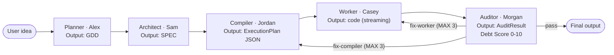

# Agent Forge OS

[한국어](README.md) | **English**

A 5-agent AI pipeline that automatically generates web games — from idea to code to verification.

[](.)
[-orange)](.)
[](.)
[](.)
[](.)

---

## Problem Statement

Vibe-coding a game makes the process opaque. You can't tell where it got stuck, what decisions the AI made, or whether the generated code actually runs in a browser.

Agent Forge OS distributes this process across 5 specialist AI agents and directly runs the final code inside an iframe sandbox for verification. Every reasoning step (GDD→SPEC→code) and the Debt Score are exposed in real time.

---

## Key Differentiators

**ⓐ 5-stage closed-loop pipeline** — Planner→Architect→Compiler→Worker→Auditor. Each stage's output is the next stage's input. Auditor verdicts trigger automatic loopback to Worker or Compiler (MAX 3 times).

**ⓑ iframe sandbox execution + Debt Score** — Generated code runs in an isolated iframe. A Probe collects DOM count, gameLoop presence, and runtime errors; the Auditor produces a Debt Score (0–10). Whether code "works" is validated by execution, not assertion.

**ⓒ Per-model-strategy cost measurement** — Switch between All Flash / Hybrid Pro / All Pro at runtime and watch per-agent token and USD spend in the live dashboard.

> A **web auto-generation instance** of the AI game studio pipeline (plan→produce→verify) — governance and HITL beyond mere auto-generation is what differentiates this tool.

---

## Architecture



**AI game studio 5-stage mapping** (provisional — author's vault design, in progress):

| Studio stage | AgentForge mapping | Status |
| --- | --- | --- |
| ① Plan — GDD, game design | Planner (Alex) | Implemented |
| ② Asset — sprites, tiles | — | **Out of scope** |
| ③ Produce — code generation | Architect + Compiler + Worker | Implemented |
| ④ Verify — closed-loop validation | Auditor + iframe + Debt Score | Implemented (core strength) |
| ⑤ Evolve — pattern/failure accumulation | — | **Out of scope** |

### iframe Verification Flow

```text
Worker-generated code
      ↓
  iframe sandbox (allow-scripts)
      ↓
  Probe injected (rAF/setInterval detection, console override, window.onerror)
      ↓
  RuntimeReport collected after 3s
  ├─ DOM element count
  ├─ gameLoop detected (rAF/setInterval ≤100ms → true)
  └─ forced termination after 5s timeout
      ↓
  Auditor → Debt Score 0-10
  (0-4: pass / 5-10: fix loopback, MAX_AUDIT_LOOPS=3)
```

### E2E Measurement Results

> Fields below are auto-populated by running `npm run dev`, completing the pipeline, clicking Dashboard "Save Results", then running `node scripts/fill-metrics.mjs`.

| Metric | Value |
| --- | --- |
| Debt Score (slime-survivors) | [not measured] |
| Loopback count | [not measured] |
| DOM element count | [not measured] |
| gameLoop detected | [not measured] |
| iframe load time | [not measured] ms |
| Total pipeline duration | [not measured] |

### Cost Case Study (by model strategy)

| Strategy | Total USD | Total tokens | Duration |
| --- | --- | --- | --- |
| All Flash (gemini-3.5-flash) | [not measured] | [not measured] | [not measured] |
| Hybrid Pro | [not measured] | [not measured] | [not measured] |
| All Pro (gemini-3.1-pro) | [not measured] | [not measured] | [not measured] |

---

## Stack

| Component | Version / Notes |
| --- | --- |
| React | 18 |
| TypeScript | 5.3 (strict) |
| Vite | 5 |
| Tailwind CSS | 3.4 |
| iframe sandbox | `allow-scripts` isolated execution + Probe validation |
| AI models | Gemini 3.5 Flash / 3.1 Pro (BYOK, `src/config/model-strategy.ts`) |
| Cost tracking | MetricsCollector + CostCalculator (per-agent token/USD) |
| Domain modes | Game / Software / Docs |

### Model Strategies

| Strategy | Planner | Architect | Worker | Auditor | Profile |
| --- | --- | --- | --- | --- | --- |
| All Flash | Flash | Flash | Flash | Flash | Fast · low cost |
| Hybrid Pro | Flash | Pro | Flash | Pro | Pro for design/review |
| All Pro | Pro | Pro | Pro | Pro | Highest quality |

---

## Quick Start

```bash
npm install

# Set Gemini API Key (BYOK — runtime only, not bundled into dist)
cp .env.example .env
# .env: VITE_AI_API_KEY=<your-gemini-key>

npm run dev        # http://localhost:5173
npm run type-check # tsc --noEmit
npm run lint       # eslint src
```

**Auto-populate metrics**: After a pipeline run → Dashboard "Save Results" → `docs/last-run-metrics.json` → `node scripts/fill-metrics.mjs`.

---

## Honesty & Limitations

- **Debt Score / cost figures** = `[not measured]`. No claims before measurement.
- **Asset generation (sprites, tiles)** = out of current scope. Code is generated but art asset creation is not implemented.
- **Self-evolution (experience accumulation, pattern learning)** = out of current scope. Room for future extension.
- **game-studio-pipeline** = author's vault design, in progress (provisional). AgentForge is an **independent web implementation** sharing the same philosophy — not the same project.
- **This tool's outputs** = self-generated games (e.g. slime-survivors). Not outputs of separate projects (e.g. ClaudeCraft).

---

## License

MIT © 2026
