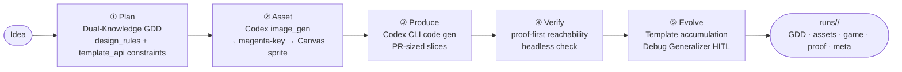

# Agent Forge OS

[한국어](README.md) | **English**

An AI game studio that runs a single idea through a Codex CLI pipeline: **Plan → Asset → Produce → Verify → Evolve**.

[](.)
[](.)
[](.)
[](.)
[](.)

> 🎮 **Live showcase — [play the actually-generated games right now](https://ljhljh0703-cmd.github.io/agent-forge/portfolio.html)**
> Two pipeline-generated games run in the browser (generating games requires Codex CLI; playing them does not).

---

## Problem Statement

Vibe-coding a game leaves the process opaque and uncontrolled.

- You can't tell where it got stuck or what decisions the AI made.
- There's no real verification that the generated code is *actually playable*.
- Every session starts from scratch — repeated mistakes don't accumulate into knowledge.

Agent Forge OS addresses all three: a **Codex CLI orchestrator** structures the pipeline, *proof-first* verification checks playability before merging, and a *self-evolving* studio memory grows with every game built.

---

## Key Differentiators

**ⓐ Codex CLI single pipeline** — A Node orchestrator drives `codex exec --json` for both code generation and `image_gen` asset creation in one flow. Browser-based Gemini direct calls are deprecated. Source: `orchestrator/src/generate.ts`.

**ⓑ Proof-first reachability** — An observation digest (`window.__af { status, score, playerMoved, playerPos, frame }`) and command surface (`window.__afStep(input, dt)`) are used to headlessly verify that the game is *actually playable*: playerMoves, scoreChanges, win/fail reachable. **Dead screens are hard-blocked — zero false passes.** Source: `orchestrator/src/reachability.ts`.

**ⓒ Self-evolving studio memory** — Completed games are distilled into reusable scaffolds (Template), and repeated errors (≥3 occurrences) are promoted to pre-check rule *candidates* (Debug Generalizer). Only verified fixes are recorded; **rule activation requires HITL** (author confirmation). Source: `orchestrator/src/evolution.ts`, `studio-memory/`.

> The combination of Codex CLI orchestration + proof-first + self-evolution is the core of a game studio that gets easier to use the more you build with it.

---

## Architecture



**Vault 5-stage implementation mapping** (provisional — author's vault design, in progress):

| Stage | Implementation | Status |
| --- | --- | --- |
| ① Plan — Dual-Knowledge GDD | `template_api` constraints injected into GDD to bound design to buildable scope | **Implemented [fact, verified]** |
| ② Asset — Codex image_gen → Canvas sprite | magenta-key transparency → grid slice → atlas assembly | **Implemented [fact, verified]** |
| ③ Produce — Codex CLI code generation | `codex exec --json` orchestration, PR-sized slices | **Implemented [fact, verified]** |
| ④ Verify — proof-first reachability | headless playerMoves·scoreChanges·terminal check, dead-screen hard-block | **Implemented [fact, verified]** |
| ⑤ Evolve — Template·Debug self-evolution | Template stability accumulation + Debug Generalizer HITL candidate promotion | **Implemented [fact, verified]** / cumulative effect [not yet measured] |

### runs/<id>/ output structure

```text
runs/<runId>/
├── gdd.md                     # Dual-Knowledge GDD
├── game/index.html            # Standalone HTML5 Canvas game
├── assets/
│   ├── codex-raw.png          # Raw Codex image_gen output
│   ├── codex-sprite.png       # Magenta-keyed sprite
│   └── atlas.json             # Grid slice coordinates
├── proof/
│   ├── template-api-check.json   # in_scope / flagged classification
│   ├── reachability.json         # playerMoves·scoreChanges·win/fail
│   ├── dead-reachability.json    # Dead-screen block evidence
│   └── snapshot.png              # Headless screenshot
└── meta.json                  # Full pipeline meta + evolution record
```

### studio-memory/ structure

```text
studio-memory/
├── templates.json         # Reusable scaffolds (stability N/5, HITL stable threshold)
├── rule-candidates.json   # Rule candidates (active=false, awaiting HITL)
├── debug-log.json         # Repeated error log
└── active-rules.json      # Active rules (moved here after HITL confirmation)
```

---

## Stack

| Component | Version / Notes |
| --- | --- |
| Orchestrator | Node.js / TypeScript 5.3, `orchestrator/src/` |
| Code & asset generation | Codex CLI (`codex exec --json`, built-in `image_gen`) |
| Canvas game output | Standalone HTML5 Canvas, `game/index.html` |
| Headless proof | Chrome (Playwright iframe-based reachability) |
| Monitor dashboard | React 18 / Vite 5 / Tailwind CSS 3.4 |
| Evolution memory | `studio-memory/` (templates · rule-candidates · debug-log) |
| v1 legacy (deprecated) | Browser Gemini direct calls (`ai-client.ts`) — accessible via toggle, inactive by default |

---

## Quick Start

```bash
# Prerequisite: Codex Desktop installed and authenticated
# https://codex.com/desktop  (generate step requires Codex CLI)

npm install

# Generate a game (one-line idea)
npm run generate -- "slime swarm survival"
# → creates runs/<id>/ (GDD · assets · Canvas game · proof · meta)
# → auto-updates studio-memory/ (Template accumulation · Debug candidates)

# Monitor dashboard (visualise runs/ + studio-memory/)
npm run dev        # http://localhost:5173

# Type check
npm run type-check # tsc --noEmit

# Seed evolution debug log (sample data)
npm run evolve:seed-debug
```

**After generation — key paths to check:**

- `runs/<id>/game/index.html` — open directly in browser to play
- `runs/<id>/proof/reachability.json` — playerMoves·scoreChanges verification result
- `studio-memory/templates.json` — reusable scaffold stability
- `studio-memory/rule-candidates.json` — HITL-pending rule candidates

---

## Honesty & Limitations

- **Asset generation, Canvas games, proof-first, self-evolution mechanism** = **[fact, verified]** — `orchestrator/src/`, `runs/` (6 run evidence), `studio-memory/` all present in repo.
- **"Gets easier to use the more you build" actual productivity effect** = **[not yet measured]** — mechanism and code pass; effect evaluation pending N+ game accumulation.
- **Codex CLI required** → no instant browser demo. Compensated by `runs/` sample games and dashboard screenshots.
- **image_gen fixed at 1254px, single-sprite slice** — multi-frame slicer is a follow-up.
- **Chrome headless dependency** — Chrome required to run proof step.
- **Rule candidate activation = HITL** — zero automated promotion without author confirmation.
- **v1 browser Gemini engine (deprecated)** — `ai-client.ts` accessible via legacy toggle; main UI defaults to v2 monitor.
- **game-studio-pipeline** = author's vault design, in progress (provisional). AgentForge is an **independent web implementation** sharing the same philosophy — not the same project.
- **Separate projects (e.g. ClaudeCraft)** = cited as asset pipeline proof-of-concept only. Not AgentForge outputs.

---

## License

MIT © 2026

> Sample games in `runs/` can be opened directly in a browser. The monitor dashboard (`npm run dev`) lets you browse runs and studio-memory visually.
