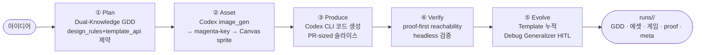

# Agent Forge OS

**한국어** | [English](README.en.md)

아이디어 한 줄을 Codex CLI 파이프라인이 **기획→에셋→코드→검증→자기진화**로 도는 AI 게임 스튜디오.

[](.)
[](.)
[](.)
[](.)
[](.)

---

## 문제정의

바이브코딩으로 게임을 만들면 과정이 불투명하고 통제가 어렵다.

- 어디서 막혔는지, AI가 무슨 판단을 내렸는지 알기 어렵다.
- 생성 코드가 실제로 *플레이 가능한지* 주장만 있고 검증이 없다.
- 매번 from-scratch — 반복된 실수가 누적되지 않는다.

Agent Forge OS는 이 세 문제를 동시에 다룬다: **Codex CLI 오케스트레이터**가 단계화하고, *변경 전 proof*로 플레이 가능성을 검증하며, *지을수록 쌓이는* 진화 메모리를 갖는다.

---

## 핵심 차별축

**ⓐ Codex CLI 단일 파이프라인** — Node 오케스트레이터가 `codex exec --json`으로 코드 생성과 `image_gen` 에셋 생성을 한 흐름에 처리한다. 브라우저 Gemini 직접호출 방식은 deprecated. 소스: `orchestrator/src/generate.ts`.

**ⓑ proof-first reachability 검증** — 관찰 digest(`window.__af { status, score, playerMoved, playerPos, frame }`)와 command surface(`window.__afStep(input, dt)`)로 게임이 *실제 플레이 가능*한지 headless 검증. playerMoves · scoreChanges · win/fail 도달을 확인하며, **dead screen은 fail로 차단 — 위장 통과 0**. 소스: `orchestrator/src/reachability.ts`.

**ⓒ 자기진화(studio-memory)** — 완성 게임을 재사용 스캐폴드로 누적(Template), 반복 에러(≥3회)를 사전체크 룰 *후보*로 승격(Debug Generalizer). 검증된 fix만 기록, **룰 활성화는 HITL**(작가 컨펌). 소스: `orchestrator/src/evolution.ts`, `studio-memory/`.

> Codex CLI 오케스트레이션 + proof-first + 자기진화의 조합이 "만들수록 쉬워지는" AI 게임 스튜디오의 핵심이다.

---

## 아키텍처



**vault 5단계 실구현 매핑** (provisional — 작가 vault 설계·진행 중):

| 단계 | 구현 | 현황 |
| --- | --- | --- |
| ① Plan — Dual-Knowledge GDD | `template_api` 제약으로 구현 가능 범위를 GDD 단계에 주입 | **구현 완료 [사실, 실재]** |
| ② Asset — Codex image_gen → Canvas sprite | magenta-key 투명화 → 그리드 슬라이스 → atlas 조립 | **구현 완료 [사실, 실재]** |
| ③ Produce — Codex CLI 코드 생성 | `codex exec --json` 오케스트레이션, PR-sized 슬라이스 | **구현 완료 [사실, 실재]** |
| ④ Verify — proof-first reachability | headless playerMoves·scoreChanges·terminal 검증, dead-screen 차단 | **구현 완료 [사실, 실재]** |
| ⑤ Evolve — Template·Debug 자기진화 | Template stability 누적 + Debug Generalizer HITL 후보 승격 | **구현 완료 [사실, 실재]** / 누적 효과 [측정전] |

### runs/<id>/ 산출 구조

```
runs/<runId>/
├── gdd.md                     # Dual-Knowledge GDD
├── game/index.html            # 단일 HTML5 Canvas 게임 (독립 실행)
├── assets/
│   ├── codex-raw.png          # Codex image_gen 원본
│   ├── codex-sprite.png       # magenta-key 처리 스프라이트
│   └── atlas.json             # 그리드 슬라이스 좌표
├── proof/
│   ├── template-api-check.json   # in_scope / flagged 분류
│   ├── reachability.json         # playerMoves·scoreChanges·win/fail
│   ├── dead-reachability.json    # dead-screen 차단 증거
│   └── snapshot.png              # headless 스크린샷
└── meta.json                  # 전 단계 메타·evolution 기록
```

### studio-memory/ 구조

```
studio-memory/
├── templates.json         # 재사용 스캐폴드 (stability N/5, HITL stable 기준)
├── rule-candidates.json   # 룰 후보 (active=false, HITL 대기)
├── debug-log.json         # 반복 에러 로그
└── active-rules.json      # 활성 룰 (HITL 컨펌 후 이동)
```

---

## 기술 스택

| 구성 | 버전 / 비고 |
| --- | --- |
| 오케스트레이터 | Node.js / TypeScript 5.3, `orchestrator/src/` |
| 코드·에셋 생성 | Codex CLI (`codex exec --json`, 내장 `image_gen`) |
| Canvas 게임 출력 | 단일 HTML5 Canvas, `game/index.html` (독립 실행) |
| headless proof | Chrome (Playwright iframe 기반 reachability) |
| 모니터 대시보드 | React 18 / Vite 5 / Tailwind CSS 3.4 |
| 진화 메모리 | `studio-memory/` (templates · rule-candidates · debug-log) |
| v1 레거시 (deprecated) | 브라우저 Gemini 직접호출 (`ai-client.ts`) — 레거시 접근 가능, 비활성 기본 |

---

## 실행법

```bash
# 전제: Codex Desktop 설치 및 인증
# https://codex.com/desktop  (Codex CLI 없으면 generate 단계 불가)

npm install

# 게임 생성 (아이디어 한 줄)
npm run generate -- "슬라임 대피 서바이벌"
# → runs/<id>/ 생성 (GDD · 에셋 · Canvas 게임 · proof · meta)
# → studio-memory/ 자동 갱신 (Template 누적 · Debug 후보)

# 모니터 대시보드 (runs/ + studio-memory/ 시각화)
npm run dev        # http://localhost:5173

# 타입 체크
npm run type-check # tsc --noEmit

# 진화 시드 (debug-log 샘플 생성)
npm run evolve:seed-debug
```

**생성 후 확인 경로**:
- `runs/<id>/game/index.html` — 브라우저에서 직접 실행
- `runs/<id>/proof/reachability.json` — playerMoves·scoreChanges 검증 결과
- `studio-memory/templates.json` — 재사용 스캐폴드 안정성
- `studio-memory/rule-candidates.json` — HITL 대기 룰 후보

---

## 정직·한계

- **에셋 생성·Canvas 게임·proof-first·자기진화 메커니즘** = **[사실, 실재]** — `orchestrator/src/`, `runs/`(6개 run 증거), `studio-memory/` 모두 repo에 실재.
- **"지을수록 쉬워지는" 실제 생산성 효과** = **[측정전]** — 메커니즘·코드는 PASS. 효과 측정은 N+ 게임 누적 후 평가 예정.
- **Codex CLI 필수** → 즉시 브라우저 데모 불가. `runs/` 샘플 게임과 대시보드 스크린샷으로 보완.
- **image_gen 1254px 고정·단일 스프라이트 슬라이스** — 멀티프레임 슬라이서는 후속.
- **Chrome headless 의존** — proof 실행에 Chrome 필요.
- **룰 후보 활성화 = HITL** — 작가 컨펌 없이 자동 승격 0.
- **v1 브라우저 Gemini 엔진 (deprecated)** — `ai-client.ts` 레거시 접근 가능, 메인 UI는 v2 모니터.
- **game-studio-pipeline** = 작가 vault 설계·진행 중(provisional). AgentForge는 그 사상을 공유하는 **독립 웹 구현** — 동일 프로젝트 아님.
- **ClaudeCraft 등 별도 프로젝트** = 에셋 파이프라인 입증처로만 인용. AgentForge 산출물이 아님.

---

## 라이선스

MIT © 2026

> `runs/` 디렉터리에서 생성된 게임 샘플을 직접 실행해볼 수 있다. 모니터 대시보드(`npm run dev`)에서 runs·studio-memory를 시각적으로 탐색할 수 있다.
