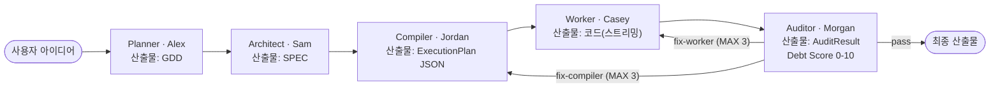

# Agent Forge OS

**한국어** | [English](README.en.md)

AI 에이전트 5단계로 웹게임을 기획→코드→검증까지 자동 생성하는 파이프라인.

[](.)
[-orange)](.)
[](.)
[](.)
[](.)

---

## 문제정의

바이브코딩으로 게임을 만들면 과정이 불투명해진다. 어디서 막혔는지, AI가 무슨 판단을 내렸는지, 생성된 코드가 실제로 브라우저에서 돌아가는지 알 수 없다.

Agent Forge OS는 이 과정을 5명의 전문 AI 에이전트로 분담·단계화하고, 최종 코드를 iframe 샌드박스에서 직접 실행 검증한다. 각 판단 근거(GDD→SPEC→코드)와 Debt Score가 실시간으로 노출된다.

---

## 핵심 차별축

**ⓐ 5단 에이전트 폐루프** — Planner→Architect→Compiler→Worker→Auditor. 각 단계 산출물이 다음 단계의 입력이 되고, Auditor 판정에 따라 Worker 또는 Compiler로 자동 루프백(MAX 3회).

**ⓑ iframe 샌드박스 실행 검증 + Debt Score** — 생성 코드를 격리된 iframe에서 직접 실행. Probe가 DOM 수·gameLoop 존재·런타임 오류를 수집하고 Auditor가 Debt Score(0–10)를 산출. 코드가 "돌아가는지"를 주장이 아닌 실행으로 검증.

**ⓒ 모델전략별 비용 계측** — All Flash / Hybrid Pro / All Pro 전략을 런타임에 전환하고 에이전트별 토큰·USD를 대시보드에서 실시간 확인.

> AI 게임 스튜디오 파이프라인(기획→제작→검증)의 **웹 자동생성 인스턴스** — 자동생성을 넘은 거버넌스·HITL이 이 도구의 차별점이다.

---

## 아키텍처



**AI 게임 스튜디오 5단계 매핑** (provisional — 작가 vault 설계·진행 중):

| 스튜디오 단계 | AgentForge 대응 | 현황 |
| --- | --- | --- |
| ① Plan — 기획·GDD | Planner (Alex) | 구현 완료 |
| ② Asset — 스프라이트·타일 생성 | agent-sprite-forge 방식 스타터 팩 + Canvas atlas loader | **씨앗 구현** |
| ③ Produce — 코드 생성 | Architect + Compiler + Worker | 구현 완료 |
| ④ Verify — 폐루프 검증 | Auditor + iframe + Debt Score | 구현 완료 (핵심 강점) |
| ⑤ Evolve — 패턴·실패 자동 누적 | — | **현재 범위 밖** |

### iframe 검증 흐름

```text
Worker 생성 코드
      ↓
  iframe sandbox (allow-scripts)
      ↓
  Probe 주입 (rAF·setInterval 감지, console 오버라이드, window.onerror)
      ↓
  3초 후 RuntimeReport 수집
  ├─ DOM 요소 수 (elementCount)
  ├─ gameLoop 감지 (rAF/setInterval ≤100ms → true)
  └─ 5초 타임아웃 시 강제 종료
      ↓
  Auditor → Debt Score 0-10
  (0-4: pass / 5-10: fix 루프백, MAX_AUDIT_LOOPS=3)
```

### E2E 실측 결과

> 아래 수치는 `npm run dev` 후 파이프라인 완주 → Dashboard "결과 저장" → `node scripts/fill-metrics.mjs` 실행으로 자동 채워집니다.

| 지표 | 값 |
| --- | --- |
| Debt Score (slime-survivors) | [측정전] |
| 루프백 횟수 | [측정전] |
| DOM 요소 수 | [측정전] |
| gameLoop 감지 | [측정전] |
| iframe 로드 시간 | [측정전] |
| 파이프라인 총 소요 | [측정전] |

### 비용 케이스스터디 (모델전략별)

| 전략 | 총 USD | 총 토큰 | 소요 시간 |
| --- | --- | --- | --- |
| All Flash (gemini-3.5-flash) | [측정전] | [측정전] | [측정전] |
| Hybrid Pro | [측정전] | [측정전] | [측정전] |
| All Pro (gemini-3.1-pro) | [측정전] | [측정전] | [측정전] |

---

## 기술 스택

| 구성 | 버전 / 비고 |
| --- | --- |
| React | 18 |
| TypeScript | 5.3 (strict) |
| Vite | 5 |
| Tailwind CSS | 3.4 |
| iframe sandbox | `allow-scripts` 격리 실행 + Probe 검증 |
| AI 모델 | Gemini 3.5 Flash / 3.1 Pro (BYOK, `src/config/model-strategy.ts`) |
| 비용 계측 | MetricsCollector + CostCalculator (에이전트별 토큰·USD) |
| 도메인 모드 | Game / Software / Docs |

### 모델 전략

| 전략 | Planner | Architect | Worker | Auditor | 특징 |
| --- | --- | --- | --- | --- | --- |
| All Flash | Flash | Flash | Flash | Flash | 빠름·저비용 |
| Hybrid Pro | Flash | Pro | Flash | Pro | 설계·검토만 Pro |
| All Pro | Pro | Pro | Pro | Pro | 최고 품질 |

---

## 실행법

```bash
npm install

# Gemini API Key 설정 (BYOK — 런타임 전용, dist 번들 안 됨)
cp .env.example .env
# .env: VITE_AI_API_KEY=<your-gemini-key>

npm run dev        # http://localhost:5173
npm run type-check # tsc --noEmit
npm run lint       # eslint src
```

**실측 수치 자동반영**: 파이프라인 완주 → Dashboard "결과 저장" 클릭 → `docs/last-run-metrics.json` 저장 → `node scripts/fill-metrics.mjs` 실행.

---

## 정직·한계

- **Debt Score·비용 수치** = `[측정전]`. 측정 완료 전 수치 주장 없음.
- **에셋 생성(스프라이트·타일)** = agent-sprite-forge 방식의 스타터 팩과 Canvas atlas loader 씨앗 구현. 전 파이프라인 자동연결은 후속.
- **자기진화(경험 누적·패턴 학습)** = 현재 구현 범위 밖. 향후 확장 여지.
- **game-studio-pipeline** = 작가 vault 설계·진행 중(provisional). AgentForge는 그 사상을 공유하는 **독립적 웹 구현**이며 동일 프로젝트가 아님.
- **본 도구 산출물** = slime-survivors 등 자체 생성 게임. 별도 프로젝트(ClaudeCraft 등)의 산출이 아님.

---

## 라이선스

MIT © 2026
