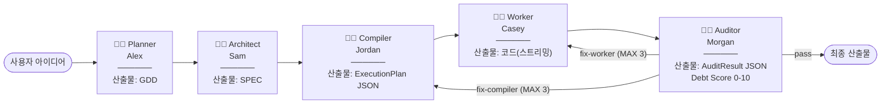

# Agent Forge OS

[](.)
[-orange)](.)
[](.)
[](.)

> **바이브코딩의 문제**: 아이디어 → 코드까지 과정이 블랙박스 — 어디서 막혔는지, AI가 무슨 판단을 했는지, 생성된 코드가 실제로 돌아가는지 알 수 없다.
>
> **Agent Forge OS**: 5명의 전문가 AI 에이전트가 역할을 분담해 게임·소프트웨어·문서를 단계별로 생성·검증·루프백하는 **폐루프(closed-loop) 파이프라인**. 각 판단 근거와 Debt Score가 실시간으로 보인다.

---

## 5단 파이프라인



### iframe 샌드박스 검증 흐름

```
Worker 생성 코드
      ↓
  iframe sandbox (allow-scripts)
      ↓
  Probe 주입 (rAF·setInterval 감지, console 오버라이드, window.onerror)
      ↓
  3초 후 RuntimeReport 수집
  ├─ DOM 요소 수 (elementCount)
  ├─ gameLoop 감지 (rAF/setInterval ≤100ms → true)
  └─ 5초 타임아웃 시 강제 종료
      ↓
  Auditor → Debt Score 0-10 산출
  (0-4: pass / 5-10: fix 루프백, MAX_AUDIT_LOOPS=3)
```

---

## 검증 결과 (E2E 실측)

> 아래 수치는 Task 2 E2E 실행 후 채워집니다.

| 지표 | 값 |
|------|----|
| Debt Score (slime-survivors) | [측정전] |
| 루프백 횟수 | [측정전] |
| DOM 요소 수 | [측정전] |
| gameLoop 감지 | [측정전] |
| iframe 로드 시간 | [측정전] ms |
| 파이프라인 총 소요 | [측정전] |

### 비용 케이스스터디 (모델전략별)

| 전략 | 총 USD | 입력 토큰 | 출력 토큰 |
|------|--------|----------|----------|
| All Flash (gemini-3.5-flash) | [측정전] | [측정전] | [측정전] |
| Hybrid Pro | [측정전] | [측정전] | [측정전] |
| All Pro (gemini-3.1-pro) | [측정전] | [측정전] | [측정전] |

---

## 스크린샷

| Dashboard (토큰·비용) | Pipeline 진행 | Live Canvas | Agent Status |
|----------------------|--------------|-------------|--------------|
| *(측정 후 추가)* | *(측정 후 추가)* | *(측정 후 추가)* | *(측정 후 추가)* |

---

## 기술 스택

| 구성 | 버전 / 비고 |
|------|------------|
| React | 18 |
| TypeScript | 5.3 (strict) |
| Vite | 5 |
| Tailwind CSS | 3.4 |
| iframe sandbox | `allow-scripts` 격리 실행 + Probe 검증 |
| AI 모델 | Gemini 3.5 Flash / 3.1 Pro (`src/config/model-strategy.ts`, BYOK) |
| 비용 계측 | MetricsCollector + CostCalculator (에이전트별 토큰·USD) |

---

## 빠른 시작

### 1. 설치

```bash
npm install
```

### 2. API Key 설정 (BYOK)

```bash
cp .env.example .env
# .env에 Gemini API Key 입력
# VITE_AI_API_KEY=AIza...
```

> **보안**: 빌드·배포 시 키가 `dist/`에 번들되지 않습니다. 런타임 BYOK 방식 전용.

### 3. 개발 서버 실행

```bash
npm run dev        # http://localhost:5173
npm run type-check # tsc --noEmit
npm run lint       # eslint src
```

---

## 도메인 모드

| 모드 | 입력 | 산출물 |
|------|------|--------|
| **Game** | 게임 아이디어 | 단일 HTML 게임 (DOM 렌더링) |
| **Software** | 요구사항 | 보일러플레이트 코드 + 아키텍처 |
| **Docs** | 코드베이스 | 기술 문서 (Mermaid 포함) |

---

## 모델 전략

`src/config/model-strategy.ts`에서 런타임 전략을 선택합니다.

| 전략 | Planner | Architect | Compiler | Worker | Auditor | 특징 |
|------|---------|-----------|----------|--------|---------|------|
| **All Flash** | Flash | Flash | Flash | Flash | Flash | 빠름·저비용 |
| **Hybrid Pro** | Flash | **Pro** | Flash | Flash | **Pro** | 설계·검토만 Pro |
| **All Pro** | Pro | Pro | Pro | Pro | Pro | 최고 품질 |

---

## 프로젝트 구조

```
src/
├── config/
│   ├── model-strategy.ts    # Flash/Pro 전략 정의
│   └── domain-mode.ts       # Game/SW/Docs 도메인 설정
├── services/
│   ├── agent-service.ts     # 20+ 역할 → systemPrompt/model 매핑
│   ├── ai-client.ts         # Gemini API 래퍼 (싱글톤)
│   ├── runtime-sandbox.ts   # iframe 격리 실행 + Probe
│   ├── metrics-collector.ts # API 콜 메트릭 pub/sub
│   └── cost-calculator.ts   # 토큰 → USD 변환
├── context/
│   └── WindowContext.tsx    # 전역 상태 허브 (windows·agents·pipeline)
└── components/
    ├── DraggableWindow.tsx  # 드래그 가능 멀티 윈도우
    └── windows/
        ├── DashboardWindow.tsx   # 토큰·USD 실시간 대시보드
        ├── LiveCanvasWindow.tsx  # iframe sandbox 렌더러
        └── ...
output/
└── slime-survivors/         # 생성된 게임 산출물 예시
```

---

## 라이선스

MIT © 2026

---

*본 프로젝트는 AI 생성 코드의 폐루프 검증 프로토타입입니다. Debt Score·비용 수치는 실측 후 업데이트됩니다.*
