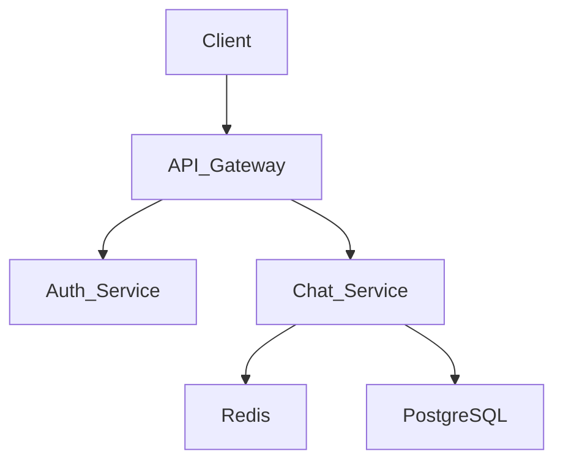

# SPEC-02: 소프트웨어 아키텍처 자동 설계 명세서

> **버전**: 1.0.0
> **작성일**: 2026-03-03
> **기반 문서**: docs/Upgrade.md §2, docs/SPEC-01-GAME-AUTOMATION.md
> **선행 조건**: SPEC-01의 Step 7-A (API 통합 레이어) 완료 필수

---

## 1. 현재 상태 분석 (AS-IS)

### 게임 특화 구조의 한계
| 요소 | 현재 (게임 전용) | 문제점 |
|------|-----------------|--------|
| Planner 프롬프트 | GDD(Game Design Document) 생성 | 게임 용어 하드코딩 |
| Architect 프롬프트 | 게임 기술 명세 (Canvas, 충돌 등) | 게임 기술 스택 전제 |
| Compiler 파싱 | `## 6. 구현 순서` 고정 패턴 | 게임 SPEC 포맷만 인식 |
| Worker 출력 | 단일 HTML/CSS/JS | 멀티파일 프로젝트 미지원 |
| Auditor 검증 | 게임 메카닉 키워드 체크 | 범용 소프트웨어 검증 불가 |
| Live Canvas | iframe 게임 실행 | 다이어그램/문서 렌더링 불가 |
| 장르 템플릿 | 게임 장르 5종 | 소프트웨어 도메인 없음 |

### 재활용 가능한 요소
| 요소 | 파일 | 재활용성 |
|------|------|---------|
| 5인 에이전트 팀 구조 | `config/employees.ts` | ✅ 역할명만 변경 |
| 윈도우 매니저 | `DraggableWindow.tsx` | ✅ 그대로 사용 |
| Agent Status Panel | `AgentStatusPanel.tsx` | ✅ 그대로 사용 |
| Taskbar | `Taskbar.tsx` | ✅ 그대로 사용 |
| Terminal 로그 | `TerminalWindow.tsx` | ✅ 그대로 사용 |
| WindowContext 상태 관리 | `WindowContext.tsx` | ✅ 확장만 필요 |
| AI Client (SPEC-01) | `services/ai-client.ts` | ✅ 그대로 사용 |
| Agent Service (SPEC-01) | `services/agent-service.ts` | ⚠️ 프롬프트 교체 필요 |

---

## 2. 목표 상태 (TO-BE)

사용자가 **소프트웨어 요구사항**을 입력하면, 5명의 에이전트가 **자동으로 협력**하여 **아키텍처 문서 + 보일러플레이트 코드**를 생성한다.

```
[사용자 입력]
"실시간 채팅 앱, 1만 동시접속, React + Node.js"

        ↓ (자동)

[Planner]   → 요구사항 명세서 (PRD) 자동 생성
[Architect] → 시스템 아키텍처 문서 자동 생성
[Compiler]  → Task 분해 + 프롬프트 생성
[Worker]    → 보일러플레이트 코드 + 다이어그램 자동 생성
[Auditor]   → 아키텍처 리뷰 + 피드백 루프

        ↓ (자동)

[Live Canvas] → 아키텍처 다이어그램 시각화 + 코드 프리뷰
```

---

## 3. 핵심 설계 결정: 도메인 스위칭 아키텍처

게임과 소프트웨어를 **하드포크하지 않고**, 단일 앱에서 **도메인 모드를 전환**하는 구조를 채택한다.

```typescript
// src/config/domain-mode.ts

type DomainMode = 'game' | 'software';

interface DomainConfig {
  mode: DomainMode;
  label: string;
  icon: string;
  plannerRole: AgentRoleConfig;
  architectRole: AgentRoleConfig;
  compilerParsingRules: ParsingRuleSet;
  workerOutputFormat: OutputFormat;
  auditorChecks: AuditCheckSet;
  canvasRenderer: CanvasRendererType;
  templates: DomainTemplate[];
}
```

이 구조를 통해:
- `employees.ts`의 역할 설명이 도메인에 따라 동적 변경
- 에이전트 프롬프트가 도메인에 따라 자동 교체
- Compiler 파싱 규칙이 도메인에 따라 분기
- Live Canvas 렌더러가 도메인에 따라 전환

---

## 4. 구현 단계 (6단계)

### Step 8-A: 도메인 스위칭 인프라
### Step 8-B: Planner 소프트웨어 모드 (PRD 자동 생성)
### Step 8-C: Architect 소프트웨어 모드 (시스템 설계 자동 생성)
### Step 8-D: Worker 소프트웨어 모드 (보일러플레이트 + 다이어그램)
### Step 8-E: Auditor 소프트웨어 모드 (아키텍처 리뷰)
### Step 8-F: Live Canvas 다이어그램 렌더링

---

## Step 8-A: 도메인 스위칭 인프라

**목적**: 게임/소프트웨어 모드를 단일 앱에서 전환 가능하게 하는 기반 구축
**추천 모델**: ⚔️ Sonnet

### 새 파일

#### `src/config/domain-mode.ts`

```typescript
export type DomainMode = 'game' | 'software';

export interface AgentRoleConfig {
  systemPrompt: string;
  model: string;
  temperature: number;
  outputFormat: string;    // 'markdown' | 'json' | 'code'
}

export interface ParsingRule {
  sectionPattern: RegExp;       // 섹션 헤더 매칭 패턴
  extractionType: 'numbered-list' | 'checkbox' | 'subheading' | 'code-block';
  targetField: string;          // 매핑될 필드명
}

export interface DomainConfig {
  mode: DomainMode;
  label: string;
  icon: string;
  description: string;

  // 에이전트 역할 재정의
  roles: {
    planner: AgentRoleConfig;
    architect: AgentRoleConfig;
    compiler: { parsingRules: ParsingRule[] };
    worker: AgentRoleConfig;
    auditor: AgentRoleConfig;
  };

  // UI 표시
  employeeOverrides: {
    [agentId: string]: {
      title: string;
      description: string;
    };
  };

  // Live Canvas 렌더러
  canvasType: 'iframe-game' | 'mermaid-diagram' | 'markdown-preview' | 'code-preview';

  // 도메인별 템플릿
  templates: DomainTemplate[];
}

export interface DomainTemplate {
  id: string;
  name: string;
  icon: string;
  description: string;
  hints: { planner: string; architect: string };
  keywords: string[];
  example: string;
}

// ──── 게임 도메인 설정 ────
export const GAME_DOMAIN: DomainConfig = {
  mode: 'game',
  label: 'Game Dev',
  icon: '🎮',
  description: '게임 기획 → 코드 자동 생성',
  roles: {
    planner: {
      systemPrompt: '당신은 게임 기획 전문가입니다...',  // SPEC-01에서 정의
      model: 'claude-sonnet-4-6',
      temperature: 0.8,
      outputFormat: 'markdown',
    },
    architect: { /* SPEC-01에서 정의 */ },
    compiler: { parsingRules: [ /* 기존 게임 파싱 규칙 */ ] },
    worker: { /* SPEC-01에서 정의 */ },
    auditor: { /* SPEC-01에서 정의 */ },
  },
  employeeOverrides: {
    planner: { title: '기획자', description: '게임 설계 및 기획을 담당합니다' },
    architect: { title: '아키텍트', description: '기술 명세와 구조를 설계합니다' },
    compiler: { title: '컴파일러', description: '실행 계획을 생성합니다' },
    worker: { title: '워커', description: '실제 코드를 작성합니다' },
    auditor: { title: '감시자', description: '품질을 검증합니다' },
  },
  canvasType: 'iframe-game',
  templates: [ /* SPEC-01의 장르 템플릿 */ ],
};

// ──── 소프트웨어 도메인 설정 ────
export const SOFTWARE_DOMAIN: DomainConfig = {
  mode: 'software',
  label: 'SW Architect',
  icon: '🏗️',
  description: '소프트웨어 요구사항 → 아키텍처 자동 설계',
  roles: {
    planner: {
      systemPrompt: '(Step 8-B에서 정의)',
      model: 'claude-sonnet-4-6',
      temperature: 0.7,
      outputFormat: 'markdown',
    },
    architect: {
      systemPrompt: '(Step 8-C에서 정의)',
      model: 'claude-sonnet-4-6',
      temperature: 0.3,
      outputFormat: 'markdown',
    },
    compiler: { parsingRules: [ /* Step 8-C에서 정의 */ ] },
    worker: {
      systemPrompt: '(Step 8-D에서 정의)',
      model: 'claude-sonnet-4-6',
      temperature: 0.2,
      outputFormat: 'code',
    },
    auditor: {
      systemPrompt: '(Step 8-E에서 정의)',
      model: 'claude-haiku-4-5',
      temperature: 0.1,
      outputFormat: 'markdown',
    },
  },
  employeeOverrides: {
    planner: { title: '요구분석가', description: '비즈니스 요구사항을 분석합니다' },
    architect: { title: '시스템 설계자', description: '기술 아키텍처를 설계합니다' },
    compiler: { title: '태스크 분해기', description: '구현 계획을 수립합니다' },
    worker: { title: '코드 생성기', description: '보일러플레이트와 문서를 생성합니다' },
    auditor: { title: '아키텍처 리뷰어', description: '설계 품질을 검증합니다' },
  },
  canvasType: 'mermaid-diagram',
  templates: [ /* Step 8-A에서 정의 */ ],
};

export const DOMAIN_CONFIGS: Record<DomainMode, DomainConfig> = {
  game: GAME_DOMAIN,
  software: SOFTWARE_DOMAIN,
};
```

### 수정 파일

#### `src/context/WindowContext.tsx` 변경

```typescript
// 추가할 상태
domainMode: DomainMode;                    // 현재 도메인 모드
domainConfig: DomainConfig;                // 현재 도메인 설정
switchDomain: (mode: DomainMode) => void;  // 도메인 전환 함수

// switchDomain 구현:
// 1. domainMode 상태 변경
// 2. employees의 title/description을 employeeOverrides로 교체
// 3. 파이프라인 상태 초기화
// 4. 로그: "🔄 도메인 전환: Game Dev → SW Architect"
```

#### `src/components/Taskbar.tsx` 변경

```
도메인 스위처 추가:
┌─────────────────────────────────────────────────────┐
│ [🎮 Game] [🏗️ SW Architect]  │  Alex  Sam  ...     │
└─────────────────────────────────────────────────────┘
```

#### `src/config/employees.ts` 변경

```typescript
// 정적 → 동적으로 전환
// domainConfig.employeeOverrides를 기반으로 title/description 동적 반영

export function getEmployees(overrides: DomainConfig['employeeOverrides']): Record<string, Employee> {
  const base = { ...EMPLOYEES };
  for (const [id, override] of Object.entries(overrides)) {
    if (base[id]) {
      base[id] = { ...base[id], ...override };
    }
  }
  return base;
}
```

### 소프트웨어 도메인 템플릿

```typescript
const SOFTWARE_TEMPLATES: DomainTemplate[] = [
  {
    id: 'web-app',
    name: 'Web Application',
    icon: '🌐',
    description: 'React/Next.js 기반 웹 애플리케이션',
    hints: {
      planner: '사용자 인증, CRUD, 대시보드 등 핵심 기능 정의',
      architect: 'SPA/SSR 결정, API 라우트, 상태 관리 패턴',
    },
    keywords: ['React', 'Next.js', 'SPA', 'SSR', 'dashboard'],
    example: '사내 프로젝트 관리 대시보드, 팀원 10명',
  },
  {
    id: 'rest-api',
    name: 'REST API Server',
    icon: '🔌',
    description: 'Node.js/Express 기반 백엔드 API',
    hints: {
      planner: '엔드포인트 목록, 인증 방식, 데이터 모델 정의',
      architect: 'DB 선택, ORM, 미들웨어 구조, 에러 핸들링',
    },
    keywords: ['Express', 'Fastify', 'REST', 'CRUD', 'middleware'],
    example: 'e-커머스 상품 관리 API, 1만 DAU',
  },
  {
    id: 'realtime',
    name: 'Realtime Application',
    icon: '⚡',
    description: 'WebSocket/SSE 기반 실시간 서비스',
    hints: {
      planner: '실시간 이벤트 유형, 동시접속 목표, 메시징 패턴',
      architect: 'WebSocket vs SSE, 메시지 브로커, 상태 동기화',
    },
    keywords: ['WebSocket', 'Socket.io', 'SSE', 'realtime', 'chat'],
    example: '실시간 채팅 앱, 1만 동시접속',
  },
  {
    id: 'cli-tool',
    name: 'CLI Tool',
    icon: '💻',
    description: 'Node.js 기반 명령줄 도구',
    hints: {
      planner: '명령어 목록, 입출력 형식, 설정 파일 구조',
      architect: '파서 선택, 플러그인 구조, 에러 처리',
    },
    keywords: ['CLI', 'commander', 'yargs', 'terminal'],
    example: '마크다운 → HTML 변환 CLI 도구',
  },
  {
    id: 'mobile-bff',
    name: 'Mobile BFF',
    icon: '📱',
    description: '모바일 앱 전용 Backend-for-Frontend',
    hints: {
      planner: '모바일 화면별 API 요구사항, 오프라인 지원 범위',
      architect: 'BFF 패턴, GraphQL vs REST, 캐싱 전략',
    },
    keywords: ['BFF', 'GraphQL', 'mobile', 'caching'],
    example: '배달 앱 BFF, 주문/배달 실시간 추적',
  },
];
```

### 완료 기준
- [ ] Taskbar에 도메인 스위처(Game / SW Architect)가 표시된다
- [ ] 도메인 전환 시 에이전트의 title/description이 변경된다
- [ ] 도메인 전환 시 파이프라인 상태가 초기화된다
- [ ] Terminal에 도메인 전환 로그가 출력된다
- [ ] `DOMAIN_CONFIGS`에 game/software 두 설정이 정의되어 있다
- [ ] 소프트웨어 템플릿 5종이 정의되어 있다

---

## Step 8-B: Planner 소프트웨어 모드 (PRD 자동 생성)

**목적**: 한 줄 요구사항 → PRD(Product Requirements Document) 자동 생성
**추천 모델**: 🏆 Opus

### Planner 시스템 프롬프트 (소프트웨어 모드)

```
당신은 시니어 프로덕트 매니저 Alex입니다.
사용자의 소프트웨어 요구사항을 받아 PRD(Product Requirements Document)를 생성합니다.

출력 형식은 반드시 다음 마크다운 구조를 따릅니다:

## 1. 프로젝트 개요
- 프로젝트명, 목적, 대상 사용자, 핵심 가치 제안

## 2. 기능 요구사항 (Functional Requirements)
### FR-01: [기능명]
- 설명, 사용자 스토리, 수용 기준
### FR-02: ...

## 3. 비기능 요구사항 (Non-Functional Requirements)
- 성능 (동시접속, 응답시간)
- 보안 (인증, 데이터 보호)
- 확장성 (수평 확장, 캐싱)
- 가용성 (SLA, 장애 복구)

## 4. 기술 제약 조건
- 필수 기술 스택 (사용자 지정)
- 호환성 요구사항
- 배포 환경

## 5. MVP 범위 정의
- Phase 1 (MVP): 최소 기능 목록
- Phase 2: 확장 기능

## 6. 용어 정의 (Glossary)
- 도메인 특화 용어 설명

제약 조건:
- MVP 우선: 최소 기능으로 빠르게 검증 가능한 범위를 정의할 것
- 기술 중립: 특정 프레임워크 강요 없이 요구사항에 집중할 것
- 수치화: 성능/보안 요구사항은 가능한 한 수치로 명시할 것
```

### 수정 파일

#### `src/components/windows/PlannerWindow.tsx` 변경

```typescript
// 도메인 모드에 따라 UI 분기

// game 모드: 기존 (아이디어 + 장르 선택)
// software 모드:
//   - 프로젝트 설명 (textarea, 2~3줄)
//   - 템플릿 선택 (Web App / REST API / Realtime / CLI / Mobile BFF)
//   - 기술 스택 힌트 (선택적 입력: "React, Node.js, PostgreSQL")
//   - 규모 선택: ○ Small (1~3명)  ● Medium (5~10명)  ○ Large (10명+)
//   - [🤖 Generate PRD] 버튼
```

### 데이터 흐름

```
사용자 입력: "실시간 채팅 앱, 1만 동시접속, React + Node.js"
템플릿 선택: Realtime Application
    ↓
PlannerWindow → AgentService.executeStream('planner', prompt + templateHints)
    ↓
[스트리밍 응답] → PlannerWindow 미리보기에 실시간 표시
    ↓
완료 → pipelineState.prd에 저장 (게임 모드: gdd / 소프트웨어 모드: prd)
    ↓
Agent Status Panel: Alex 상태 idle → writing → idle
Terminal 로그: "🧑‍💼 [Alex] PRD 생성 완료 (2,847자, FR 8개, NFR 4개)"
```

### 완료 기준
- [ ] 소프트웨어 모드에서 PRD 마크다운이 자동 생성된다
- [ ] PRD가 위 템플릿 구조(6개 섹션)를 따른다
- [ ] 템플릿 선택 시 관련 hints가 프롬프트에 포함된다
- [ ] 기술 스택 힌트가 입력되면 PRD에 반영된다
- [ ] 스트리밍 응답이 실시간으로 표시된다
- [ ] 게임 모드의 기존 기능이 영향받지 않는다

---

## Step 8-C: Architect 소프트웨어 모드 (시스템 설계 자동 생성)

**목적**: PRD를 기반으로 시스템 아키텍처 문서 자동 생성
**추천 모델**: ⚔️ Sonnet

### Architect 시스템 프롬프트 (소프트웨어 모드)

```
당신은 시니어 소프트웨어 아키텍트 Sam입니다.
PRD를 받아 시스템 아키텍처 문서를 생성합니다.

출력 형식은 반드시 다음 마크다운 구조를 따릅니다:

## 1. 시스템 개요
- 아키텍처 패턴 (Monolith / MVC / Microservices / Serverless)
- 기술 스택 확정 (프레임워크, 라이브러리, DB, 인프라)

## 2. 시스템 아키텍처 다이어그램


## 3. 데이터 모델 (ERD)
```mermaid
erDiagram
    USER ||--o{ MESSAGE : sends
    USER { string id PK; string name; string email }
    MESSAGE { string id PK; string content; datetime created_at }
```

## 4. API 설계
### 4.1 인증
| Method | Path | Description |
|--------|------|-------------|
| POST | /api/auth/signup | 회원가입 |

### 4.2 핵심 기능
(PRD의 FR 기반)

## 5. 디렉토리 구조
```
project/
├── src/
│   ├── controllers/
│   ├── services/
│   ├── models/
│   └── middleware/
├── tests/
└── package.json
```

## 6. 구현 순서
1. 프로젝트 초기 설정 + 보일러플레이트
2. 데이터 모델 + DB 마이그레이션
3. 인증 모듈
4. 핵심 기능 API
5. 프론트엔드 통합
6. 테스트 + 배포 설정

## 7. 완료 기준
- [ ] 기준 항목 (PRD의 수용 기준 기반)

## 8. ADR (Architecture Decision Records)
### ADR-001: [결정 제목]
- 상태: Accepted
- 맥락: (왜 이 결정이 필요했는가)
- 결정: (무엇을 선택했는가)
- 결과: (어떤 영향이 예상되는가)

제약 조건:
- Mermaid 다이어그램 필수: 시스템 아키텍처 + ERD를 Mermaid 문법으로 작성
- 구현 순서는 번호 리스트로 작성 (Compiler 파싱 호환)
- 완료 기준은 체크박스로 작성 (Auditor 검증 호환)
- ADR은 최소 2개 이상 포함
```

### Compiler 파싱 규칙 (소프트웨어 모드)

```typescript
// 소프트웨어 SPEC은 게임 SPEC과 섹션 구조가 다르므로 별도 파싱 규칙 정의

const SW_PARSING_RULES: ParsingRule[] = [
  {
    sectionPattern: /^## 6\.\s*구현 순서/i,
    extractionType: 'numbered-list',
    targetField: 'tasks',
  },
  {
    sectionPattern: /^## 4\.\s*API 설계/i,
    extractionType: 'subheading',
    targetField: 'apiEndpoints',
  },
  {
    sectionPattern: /^## 7\.\s*완료 기준/i,
    extractionType: 'checkbox',
    targetField: 'acceptanceCriteria',
  },
  {
    sectionPattern: /^## 5\.\s*디렉토리 구조/i,
    extractionType: 'code-block',
    targetField: 'directoryStructure',
  },
  {
    sectionPattern: /^## 3\.\s*데이터 모델/i,
    extractionType: 'code-block',
    targetField: 'dataModel',
  },
  {
    sectionPattern: /^## 2\.\s*시스템 아키텍처 다이어그램/i,
    extractionType: 'code-block',
    targetField: 'architectureDiagram',
  },
];
```

### 데이터 흐름

```
pipelineState.prd (Planner 결과)
    ↓
ArchitectWindow → AgentService.executeStream('architect', prd)
    ↓
[스트리밍 응답] → ArchitectWindow에 실시간 표시
    ↓
Mermaid 코드 블록 감지 → 실시간 다이어그램 미리보기
    ↓
완료 → pipelineState.spec에 저장
    ↓
Compiler가 SW_PARSING_RULES로 파싱 → task 분해
```

### 완료 기준
- [ ] PRD를 입력받아 아키텍처 문서 마크다운을 자동 생성한다
- [ ] Mermaid 다이어그램(시스템 아키텍처 + ERD)이 포함된다
- [ ] API 설계 테이블이 PRD의 FR 기반으로 생성된다
- [ ] 구현 순서가 번호 리스트로 Compiler 파싱 호환 형식이다
- [ ] 완료 기준이 체크박스로 Auditor 검증 호환 형식이다
- [ ] ADR이 최소 2개 포함된다

---

## Step 8-D: Worker 소프트웨어 모드 (보일러플레이트 + 다이어그램)

**목적**: Compiler의 task를 기반으로 보일러플레이트 코드 + 문서를 자동 생성
**추천 모델**: ⚔️ Sonnet

### 게임 모드 vs 소프트웨어 모드 Worker 차이

| 항목 | 게임 모드 | 소프트웨어 모드 |
|------|----------|---------------|
| 출력 형태 | 단일 HTML/CSS/JS | 멀티파일 프로젝트 |
| 파일 구조 | 플랫 (3파일) | 트리 (디렉토리 구조) |
| 실행 가능성 | 즉시 실행 (iframe) | 설정 후 실행 (npm install 등) |
| 추가 산출물 | 없음 | README, Dockerfile, .env.example |

### Worker 출력물 정의

```typescript
interface SWGeneratedOutput {
  // 1. 프로젝트 구조
  files: GeneratedFile[];        // 코드 파일들

  // 2. 문서
  readme: string;                // README.md 내용
  envExample: string;            // .env.example 내용

  // 3. 다이어그램 (Mermaid 원본)
  diagrams: {
    architecture: string;        // 시스템 아키텍처 다이어그램
    erd: string;                 // ERD
    sequence?: string;           // 시퀀스 다이어그램 (선택적)
    deployment?: string;         // 배포 다이어그램 (선택적)
  };

  // 4. 설정 파일
  configs: GeneratedFile[];      // package.json, tsconfig.json 등
}
```

### Worker 시스템 프롬프트 (소프트웨어 모드)

```
당신은 시니어 풀스택 개발자 Casey입니다.
아키텍처 문서의 구현 순서에 따라 보일러플레이트 코드를 생성합니다.

규칙:
1. 각 파일은 ```파일명 코드 블록으로 출력
   예시:
   ```src/index.ts
   import express from 'express';
   ...
   ```
2. 파일 간 import 경로가 정확해야 함
3. TypeScript 우선 (사용자 지정 없으면)
4. 모든 함수에 JSDoc 주석
5. 환경 변수는 .env.example에 키만 정의
6. 에러 핸들링 미들웨어 포함
7. 테스트 파일은 __tests__/ 디렉토리에 배치
```

### 코드 추출기 확장

```typescript
// src/utils/code-extractor.ts 확장

// 소프트웨어 모드의 코드 블록은 파일 경로를 포함:
// ```src/controllers/auth.ts
// import { Router } from 'express';
// ...
// ```

function extractSWCodeBlocks(markdown: string): GeneratedFile[] {
  // 1. ```filepath 패턴으로 코드 블록 추출
  // 2. filepath에서 디렉토리와 파일명 분리
  // 3. GeneratedFile 배열 반환
}
```

### 완료 기준
- [ ] Compiler의 task별 프롬프트를 AI API에 전달하여 코드를 생성한다
- [ ] 파일 경로가 포함된 코드 블록을 정확히 추출한다
- [ ] 디렉토리 구조(트리)를 포함한 멀티파일 프로젝트를 생성한다
- [ ] README.md, .env.example이 자동 생성된다
- [ ] Mermaid 다이어그램 원본이 보존된다
- [ ] Terminal에 파일별 생성 로그가 출력된다

---

## Step 8-E: Auditor 소프트웨어 모드 (아키텍처 리뷰)

**목적**: 생성된 아키텍처와 코드의 품질을 검증하고 피드백
**추천 모델**: ⚔️ Sonnet

### 소프트웨어 모드 검증 항목

```typescript
interface SWAuditCheck {
  category: 'architecture' | 'api' | 'security' | 'completeness' | 'consistency';
  item: string;
  passed: boolean;
  severity: 'critical' | 'major' | 'minor';
  detail: string;
}
```

#### 검증 규칙

```
1. 아키텍처 검증 (architecture):
   - PRD의 NFR(비기능 요구사항)이 아키텍처에 반영되었는가
   - 선택된 패턴(Monolith/MVC 등)이 규모에 적합한가
   - 데이터 모델이 FR의 엔티티를 모두 포함하는가

2. API 검증 (api):
   - PRD의 모든 FR에 대응하는 API 엔드포인트가 존재하는가
   - RESTful 규칙 준수 (HTTP Method 올바른 사용)
   - 인증이 필요한 엔드포인트에 인증 미들웨어가 적용되었는가

3. 보안 검증 (security):
   - 비밀번호 해싱이 포함되어 있는가
   - JWT/세션 기반 인증이 구현되어 있는가
   - SQL Injection / XSS 방지 패턴이 있는가
   - .env에 민감 정보가 하드코딩되지 않았는가

4. 완전성 검증 (completeness):
   - 아키텍처 문서의 '구현 순서' 대비 생성된 파일 매핑
   - 아키텍처 문서의 '완료 기준' 체크박스 충족률
   - 디렉토리 구조와 실제 생성된 파일의 일치 여부

5. 일관성 검증 (consistency):
   - PRD ↔ 아키텍처 문서 용어 일치
   - 아키텍처 문서 ↔ 코드 네이밍 일치
   - import 경로가 실제 파일 구조와 일치
```

### Auditor 시스템 프롬프트 (소프트웨어 모드)

```
당신은 시니어 아키텍처 리뷰어 Morgan입니다.
PRD, 아키텍처 문서, 생성된 코드를 비교 분석하여 품질을 검증합니다.

출력 형식:
## 검증 결과 요약
- 전체 점수: X/10
- Critical 이슈: N개
- Major 이슈: N개
- Minor 이슈: N개

## 상세 검증
### [카테고리명]
| # | 항목 | 결과 | 심각도 | 상세 |
|---|------|------|--------|------|
| 1 | ... | ✅/❌ | critical/major/minor | ... |

## 수정 권장사항
1. [가장 중요한 수정 사항]
2. [다음 중요한 수정 사항]
...

## 판정
- PASS / FAIL (Debt Score 기준)
- 피드백 대상: worker / compiler / 사용자
```

### 피드백 루프 (소프트웨어 모드 특화)

```
Auditor 검증 결과
    ↓
Score >= 5.0 (FAIL)
    ↓
severity별 분류:
  - critical 이슈 존재 → 'fix-compiler' (설계 수정 필요)
  - major만 존재 → 'fix-worker' (코드 수정으로 해결 가능)
  - minor만 존재 → PASS (경고만 표시)
    ↓
수정 프롬프트 자동 생성 시 이전 검증 결과를 컨텍스트로 포함:
  "[수정 요청]
   이전 검증에서 발견된 이슈:
   - Critical: JWT 검증 미들웨어 누락
   - Major: User 모델에 email 필드 없음
   수정된 전체 코드를 출력해주세요."
    ↓
Worker/Compiler 재실행 → Auditor 재검증 (최대 3회)
```

### 완료 기준
- [ ] 5가지 카테고리(아키텍처/API/보안/완전성/일관성)를 검증한다
- [ ] severity(critical/major/minor)를 분류한다
- [ ] critical 이슈 시 compiler로, major 이슈 시 worker로 루프백한다
- [ ] minor만 있으면 경고와 함께 PASS 처리한다
- [ ] PRD ↔ 아키텍처 ↔ 코드 간 일관성을 검증한다
- [ ] 최대 3회 루프 후 중단한다

---

## Step 8-F: Live Canvas 다이어그램 렌더링

**목적**: Mermaid 다이어그램 + 코드 프리뷰를 Live Canvas에 표시
**추천 모델**: ⚡ Haiku

### 현재 → 변경 (도메인별 분기)

```
게임 모드: iframe + Blob URL (기존 SPEC-01)
소프트웨어 모드: Mermaid 다이어그램 + 파일 트리 + 코드 프리뷰
```

### 새 의존성

```json
// package.json에 추가
"dependencies": {
  "mermaid": "^11.0.0"
}
```

### 수정 파일

#### `src/components/windows/LiveCanvasWindow.tsx` 변경

```typescript
// 도메인 모드에 따라 렌더러 분기

// game 모드: 기존 iframe 렌더링
// software 모드: 탭 기반 뷰

// 탭 구조:
// [📊 Architecture] [📋 ERD] [📁 Files] [📄 Code]

// Architecture 탭: Mermaid 시스템 아키텍처 다이어그램 렌더링
// ERD 탭: Mermaid ERD 렌더링
// Files 탭: 생성된 파일 디렉토리 트리 표시
// Code 탭: 선택한 파일의 코드 하이라이트 프리뷰
```

### UI 변경사항

```
┌─────────────────────────────────────────────────┐
│ 🎮 Live Canvas                           [_][X] │
├─────────────────────────────────────────────────┤
│ [📊 Architecture] [📋 ERD] [📁 Files] [📄 Code] │
│                                                 │
│  ┌─────────────────────────────────────────┐    │
│  │                                         │    │
│  │   ┌──────────┐     ┌──────────────┐    │    │
│  │   │  Client   │────▶│ API Gateway  │    │    │
│  │   └──────────┘     └──────┬───────┘    │    │
│  │                           │             │    │
│  │              ┌────────────┼──────────┐  │    │
│  │              ▼            ▼          ▼  │    │
│  │         ┌────────┐ ┌──────────┐ ┌─────┐│    │
│  │         │  Auth  │ │   Chat   │ │Redis││    │
│  │         └────────┘ └──────────┘ └─────┘│    │
│  │                                         │    │
│  └─────────────────────────────────────────┘    │
│                                                 │
│  [📥 Download All] [📋 Copy Mermaid]            │
└─────────────────────────────────────────────────┘
```

### Files 탭 UI

```
┌─────────────────────────────────────────────────┐
│ [📊 Architecture] [📋 ERD] [📁 Files] [📄 Code] │
│                                                 │
│  📁 my-chat-app/                                │
│  ├── 📄 package.json          (42줄)            │
│  ├── 📄 tsconfig.json         (18줄)            │
│  ├── 📄 .env.example          (8줄)             │
│  ├── 📄 README.md             (95줄)            │
│  ├── 📁 src/                                    │
│  │   ├── 📄 index.ts          (23줄)  ← 클릭   │
│  │   ├── 📁 controllers/                        │
│  │   │   ├── 📄 auth.ts       (67줄)            │
│  │   │   └── 📄 chat.ts       (89줄)            │
│  │   ├── 📁 models/                             │
│  │   │   ├── 📄 user.ts       (34줄)            │
│  │   │   └── 📄 message.ts    (28줄)            │
│  │   └── 📁 middleware/                         │
│  │       └── 📄 auth.ts       (41줄)            │
│  └── 📁 tests/                                  │
│      └── 📄 auth.test.ts      (52줄)            │
│                                                 │
│  총 12개 파일 | 487줄 | [📥 Download ZIP]       │
└─────────────────────────────────────────────────┘
```

### 완료 기준
- [ ] 소프트웨어 모드에서 Mermaid 다이어그램이 렌더링된다
- [ ] 탭 전환(Architecture / ERD / Files / Code)이 작동한다
- [ ] Files 탭에서 디렉토리 트리가 표시된다
- [ ] 파일 클릭 시 Code 탭에서 코드 프리뷰가 표시된다
- [ ] Download ZIP으로 전체 프로젝트를 다운로드할 수 있다
- [ ] Copy Mermaid로 다이어그램 소스를 복사할 수 있다
- [ ] 게임 모드의 기존 iframe 렌더링이 영향받지 않는다

---

## 5. 전체 파이프라인 흐름도 (소프트웨어 모드)

```
┌──────────────────────────────────────────────────────────────────┐
│                                                                  │
│  [Taskbar] 🏗️ SW Architect 모드 선택                             │
│                                                                  │
│  [사용자] 소프트웨어 요구사항 입력 + 템플릿 선택 (선택적)          │
│           "실시간 채팅 앱, 1만 동시접속, React + Node.js"         │
│                                                                  │
│      ↓ Step 8-B                                                  │
│                                                                  │
│  [Planner/Alex] ──AI API──→ PRD 자동 생성                        │
│      │  기능 요구사항(FR) + 비기능 요구사항(NFR) + MVP 범위       │
│      ↓ (사용자 Accept)                                           │
│                                                                  │
│  [Architect/Sam] ──AI API──→ 아키텍처 문서 자동 생성              │
│      │  Mermaid 다이어그램 + API 설계 + ERD + ADR                │
│      ↓ (사용자 Accept)                                           │
│                                                                  │
│  [Compiler/Jordan] ──로컬──→ 아키텍처 문서 파싱 → Task 분해      │
│      │  SW_PARSING_RULES 적용                                    │
│      ↓                                                           │
│                                                                  │
│  [Worker/Casey] ──AI API──→ 보일러플레이트 코드 자동 생성         │
│      │  멀티파일 프로젝트 + README + .env.example                │
│      ↓                                                           │
│                                                                  │
│  [Auditor/Morgan] ──AI+로컬──→ 아키텍처 리뷰                     │
│      │  아키텍처/API/보안/완전성/일관성 5대 카테고리 검증         │
│      │                                                           │
│      ├── PASS → Live Canvas에 다이어그램 + 파일 트리 표시        │
│      └── FAIL → severity별 루프백 (최대 3회)                     │
│                                                                  │
└──────────────────────────────────────────────────────────────────┘
```

---

## 6. 구현 우선순위 및 의존성

```
Step 8-A (도메인 스위칭)
    ↓
Step 8-B (Planner SW)
    ↓
Step 8-C (Architect SW)
    ↓
Step 8-D (Worker SW) ←── Step 8-F (Live Canvas 다이어그램, 병렬 가능)
    ↓
Step 8-E (Auditor SW)
```

| Step | 의존성 | 추천 모델 | 예상 복잡도 |
|------|--------|----------|------------|
| 8-A | SPEC-01 7-A 완료 | ⚔️ Sonnet | HIGH |
| 8-B | 8-A | 🏆 Opus | MID |
| 8-C | 8-B | ⚔️ Sonnet | MID |
| 8-D | 8-C | ⚔️ Sonnet | HIGH |
| 8-E | 8-D | ⚔️ Sonnet | HIGH |
| 8-F | 8-D | ⚡ Haiku | MID |

### SPEC-01과의 의존 관계

```
SPEC-01 Step 7-A (AI Client) ──필수──→ SPEC-02 전체
SPEC-01 Step 7-F (Live Canvas 기반) ──참조──→ SPEC-02 Step 8-F
```
