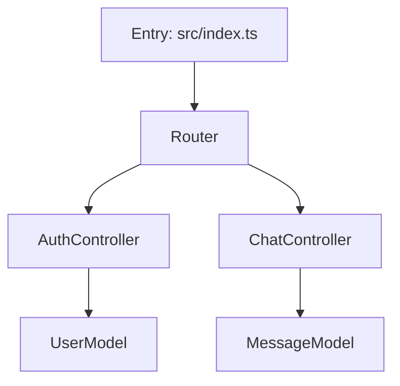
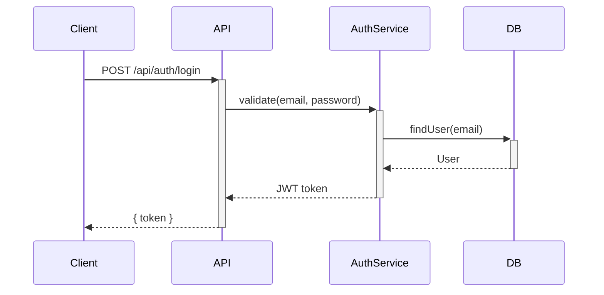

# SPEC-04: 기술 문서 자동 생성 명세서

> **버전**: 1.0.0
> **작성일**: 2026-03-03
> **기반 문서**: docs/Upgrade.md §4, docs/SPEC-01 ~ SPEC-03
> **선행 조건**: SPEC-01 Step 7-A (API 통합 레이어), SPEC-02 Step 8-A (도메인 스위칭) 완료

---

## 1. 현재 상태 분석 (AS-IS)

### 문서 관련 현황
| 요소 | 현재 상태 | 한계 |
|------|----------|------|
| 산출물 형식 | 게임 코드 (HTML/CSS/JS) | 문서 생성 미지원 |
| Planner 출력 | GDD (게임 기획서) | 범용 문서 생성 불가 |
| Live Canvas | iframe 게임 실행 | 마크다운 렌더링 불가 |
| MemoWindow | 읽기 전용 텍스트 | 문서 편집/프리뷰 불가 |
| 코드 분석 | 없음 | 외부 코드베이스 입력 불가 |
| 문서 템플릿 | gdd-template.md, spec-template.md | 게임 전용 2종만 |

### 재활용 가능한 요소
| 요소 | 재활용성 |
|------|---------|
| 파이프라인 구조 (5단계) | ✅ 역할 재매핑 |
| 도메인 스위칭 (SPEC-02) | ✅ 'docs' 모드 추가 |
| AI Client (SPEC-01) | ✅ 그대로 사용 |
| 메트릭 수집 (SPEC-03) | ✅ 그대로 사용 |
| PlannerWindow 입력 UI | ⚠️ 코드 입력 모드 추가 필요 |
| Live Canvas | ⚠️ 마크다운 렌더러 추가 필요 |

---

## 2. 목표 상태 (TO-BE)

사용자가 **코드베이스를 입력**하면, 5명의 에이전트가 **자동으로 협력**하여 **종합 기술 문서**를 생성한다.

```
[사용자 입력]
코드베이스 (파일 붙여넣기 / 디렉토리 구조 + 주요 파일)

        ↓ (자동)

[Planner]   → 문서 스코프 정의 (대상 독자, 문서 범위, 목차)
[Architect] → 코드 분석 (모듈 구조, 의존성, 데이터 흐름)
[Compiler]  → 문서 구조 설계 (섹션별 깊이, 다이어그램 배치)
[Worker]    → 실제 문서 작성 (README, API Reference, Guide 등)
[Auditor]   → 문서 품질 검증 (정확성, 누락, 가독성)

        ↓ (자동)

[Live Canvas] → 마크다운 렌더링 프리뷰 + 다운로드
```

---

## 3. 구현 단계 (7단계)

### Step 10-A: 도메인 모드 확장 ('docs' 모드 추가)
### Step 10-B: 코드 입력 시스템
### Step 10-C: Planner 문서 모드 (스코프 정의)
### Step 10-D: Architect 문서 모드 (코드 분석)
### Step 10-E: Worker 문서 모드 (문서 작성)
### Step 10-F: Auditor 문서 모드 (문서 품질 검증)
### Step 10-G: Live Canvas 마크다운 렌더링

---

## Step 10-A: 도메인 모드 확장 ('docs' 모드 추가)

**목적**: SPEC-02의 도메인 스위칭에 'docs' 모드를 추가
**추천 모델**: ⚡ Haiku

### 수정 파일

#### `src/config/domain-mode.ts` 변경

```typescript
// DomainMode 확장
export type DomainMode = 'game' | 'software' | 'docs';

// docs 도메인 설정 추가
export const DOCS_DOMAIN: DomainConfig = {
  mode: 'docs',
  label: 'Auto Docs',
  icon: '📚',
  description: '코드베이스 → 기술 문서 자동 생성',
  roles: {
    planner: {
      systemPrompt: '(Step 10-C에서 정의)',
      model: 'claude-sonnet-4-6',
      temperature: 0.5,
      outputFormat: 'markdown',
    },
    architect: {
      systemPrompt: '(Step 10-D에서 정의)',
      model: 'claude-sonnet-4-6',
      temperature: 0.2,
      outputFormat: 'markdown',
    },
    compiler: { parsingRules: [ /* Step 10-C에서 정의 */ ] },
    worker: {
      systemPrompt: '(Step 10-E에서 정의)',
      model: 'claude-sonnet-4-6',
      temperature: 0.3,
      outputFormat: 'markdown',
    },
    auditor: {
      systemPrompt: '(Step 10-F에서 정의)',
      model: 'claude-haiku-4-5',
      temperature: 0.1,
      outputFormat: 'markdown',
    },
  },
  employeeOverrides: {
    planner: { title: '문서 기획자', description: '문서 범위와 대상 독자를 정의합니다' },
    architect: { title: '코드 분석가', description: '코드베이스 구조를 분석합니다' },
    compiler: { title: '문서 설계자', description: '문서 구조와 섹션을 설계합니다' },
    worker: { title: '문서 작성자', description: '실제 기술 문서를 작성합니다' },
    auditor: { title: '문서 검수자', description: '문서 품질과 정확성을 검증합니다' },
  },
  canvasType: 'markdown-preview',
  templates: [ /* Step 10-A에서 정의 */ ],
};

// DOMAIN_CONFIGS 확장
export const DOMAIN_CONFIGS: Record<DomainMode, DomainConfig> = {
  game: GAME_DOMAIN,
  software: SOFTWARE_DOMAIN,
  docs: DOCS_DOMAIN,
};
```

### Taskbar 변경

```
┌───────────────────────────────────────────────────────────┐
│ [🎮 Game] [🏗️ SW Architect] [📚 Auto Docs] │ Alex Sam ...│
└───────────────────────────────────────────────────────────┘
```

### 문서 도메인 템플릿

```typescript
const DOCS_TEMPLATES: DomainTemplate[] = [
  {
    id: 'readme',
    name: 'README',
    icon: '📄',
    description: '프로젝트 소개, 설치, 실행 가이드',
    hints: {
      planner: '신규 개발자가 5분 내에 프로젝트를 이해하고 실행할 수 있도록',
      architect: '엔트리포인트, 핵심 디렉토리, 실행 명령어 중심 분석',
    },
    keywords: ['README', 'quickstart', 'getting started'],
    example: 'React + Express 프로젝트의 종합 README',
  },
  {
    id: 'api-reference',
    name: 'API Reference',
    icon: '🔌',
    description: '엔드포인트별 상세 명세',
    hints: {
      planner: 'API 소비자(프론트엔드/모바일 개발자)가 대상',
      architect: '라우트 파일, 컨트롤러, 미들웨어 중심 분석',
    },
    keywords: ['API', 'endpoint', 'REST', 'GraphQL'],
    example: 'Express REST API의 전체 엔드포인트 문서',
  },
  {
    id: 'architecture-guide',
    name: 'Architecture Guide',
    icon: '🏛️',
    description: '시스템 구조 및 설계 의사결정',
    hints: {
      planner: '시니어 개발자/신규 아키텍트가 시스템을 이해할 수 있도록',
      architect: '모듈 간 관계, 데이터 흐름, 기술 결정 이유 중심 분석',
    },
    keywords: ['architecture', 'system design', 'ADR'],
    example: '마이크로서비스 기반 e-커머스 시스템 아키텍처 문서',
  },
  {
    id: 'onboarding',
    name: 'Onboarding Guide',
    icon: '🚀',
    description: '신규 팀원용 코드베이스 안내서',
    hints: {
      planner: '주니어 개발자가 1주 내에 첫 PR을 올릴 수 있도록',
      architect: '개발 환경 설정, 코드 컨벤션, 핵심 패턴, 일상 워크플로우 중심',
    },
    keywords: ['onboarding', 'new member', 'guide'],
    example: 'Next.js + Prisma 프로젝트의 팀원 온보딩 가이드',
  },
  {
    id: 'changelog',
    name: 'Changelog',
    icon: '📋',
    description: '버전별 변경사항 자동 정리',
    hints: {
      planner: '사용자/팀원이 각 버전의 변경 내역을 빠르게 파악',
      architect: 'git log, 파일 변경 이력, 기능 추가/수정/삭제 중심 분석',
    },
    keywords: ['changelog', 'release notes', 'version'],
    example: 'SemVer 기반 CHANGELOG.md 자동 생성',
  },
  {
    id: 'user-manual',
    name: 'User Manual',
    icon: '📖',
    description: '비개발자 대상 기능 설명서',
    hints: {
      planner: '기술 배경 없는 최종 사용자가 기능을 활용할 수 있도록',
      architect: 'UI 컴포넌트, 사용자 흐름, 설정 옵션 중심 분석',
    },
    keywords: ['manual', 'user guide', 'how to use'],
    example: '관리자 대시보드의 사용자 매뉴얼',
  },
];
```

### 완료 기준
- [ ] Taskbar에 'Auto Docs' 모드가 추가된다
- [ ] 모드 전환 시 에이전트 역할이 문서 도메인으로 변경된다
- [ ] 6개 문서 템플릿이 정의되어 있다
- [ ] 기존 game/software 모드가 영향받지 않는다

---

## Step 10-B: 코드 입력 시스템

**목적**: 사용자가 코드베이스를 입력할 수 있는 다중 입력 인터페이스 구축
**추천 모델**: ⚔️ Sonnet

### 새 파일

#### `src/components/windows/CodeInputWindow.tsx`

```typescript
// 코드 입력 전용 윈도우 (docs 모드에서만 표시)

// 입력 방식 4가지:
// 1. 파일 직접 붙여넣기 (여러 파일 지원)
// 2. 디렉토리 구조 텍스트 입력
// 3. 파일 드래그앤드롭 (다중 파일)
// 4. GitHub URL 입력 (공개 저장소)
```

### UI 설계

```
┌─────────────────────────────────────────────────┐
│ 📂 Code Input                            [_][X] │
├─────────────────────────────────────────────────┤
│ [📝 Paste] [📁 Upload] [🔗 GitHub]             │
│                                                 │
│ ── 파일 목록 ──                                  │
│ ┌───────────────────────────────────────────┐   │
│ │ 📄 src/index.ts          (23줄)   [✏️][🗑️]│   │
│ │ 📄 src/controllers/auth.ts (67줄) [✏️][🗑️]│   │
│ │ 📄 src/models/user.ts    (34줄)   [✏️][🗑️]│   │
│ │ 📄 package.json          (42줄)   [✏️][🗑️]│   │
│ │                                           │   │
│ │ + 파일 추가                                │   │
│ └───────────────────────────────────────────┘   │
│                                                 │
│ ── 파일 추가 (Paste 모드) ──                     │
│ 파일명: [src/middleware/auth.ts              ]   │
│ ┌───────────────────────────────────────────┐   │
│ │ import { Request, Response, Next } from   │   │
│ │ 'express';                                │   │
│ │                                           │   │
│ │ export const authMiddleware = ...         │   │
│ └───────────────────────────────────────────┘   │
│ [+ 이 파일 추가]                                │
│                                                 │
│ ── 프로젝트 컨텍스트 (선택적) ──                  │
│ 프로젝트 설명: [Express 기반 채팅 API 서버    ]  │
│ 기술 스택: [TypeScript, Express, Prisma      ]  │
│ 주요 기능: [인증, 채팅, 알림                 ]  │
│                                                 │
│ 총 4개 파일 | 166줄 | [▶ Generate Docs]         │
└─────────────────────────────────────────────────┘
```

### 데이터 구조

```typescript
interface CodeFile {
  path: string;           // 파일 경로 (예: "src/controllers/auth.ts")
  content: string;        // 파일 내용
  language: string;       // 자동 감지 (ts, js, py, go 등)
  lineCount: number;
}

interface CodebaseInput {
  files: CodeFile[];
  projectName?: string;
  description?: string;
  techStack?: string[];
  mainFeatures?: string[];
  directoryTree?: string;  // 디렉토리 트리 텍스트
}

// Context에 추가
codebaseInput: CodebaseInput;
addCodeFile: (file: CodeFile) => void;
removeCodeFile: (path: string) => void;
updateCodeFile: (path: string, content: string) => void;
```

### 언어 자동 감지

```typescript
// src/utils/language-detector.ts

function detectLanguage(filename: string): string {
  const ext = filename.split('.').pop()?.toLowerCase();
  const langMap: Record<string, string> = {
    'ts': 'typescript', 'tsx': 'typescript',
    'js': 'javascript', 'jsx': 'javascript',
    'py': 'python',
    'go': 'go',
    'rs': 'rust',
    'java': 'java',
    'rb': 'ruby',
    'php': 'php',
    'cs': 'csharp',
    'swift': 'swift',
    'kt': 'kotlin',
    'json': 'json',
    'yaml': 'yaml', 'yml': 'yaml',
    'md': 'markdown',
    'sql': 'sql',
    'sh': 'shell', 'bash': 'shell',
    'dockerfile': 'docker',
  };
  return langMap[ext || ''] || 'plaintext';
}
```

### GitHub URL 입력 (선택적)

```typescript
// GitHub 공개 저장소에서 파일 목록 가져오기
// GitHub API: GET /repos/{owner}/{repo}/git/trees/{branch}?recursive=1

// 주의:
// - 공개 저장소만 지원 (인증 없이 접근 가능)
// - Rate limit: 60 req/hour (미인증)
// - 대형 저장소는 주요 파일만 선택적으로 가져오기
// - 바이너리 파일 제외 (이미지, 폰트 등)
```

### 완료 기준
- [ ] Paste 모드에서 파일명 + 코드를 붙여넣어 추가할 수 있다
- [ ] Upload 모드에서 여러 파일을 드래그앤드롭으로 추가할 수 있다
- [ ] GitHub URL에서 공개 저장소의 파일 목록을 가져올 수 있다
- [ ] 파일별 편집(✏️) / 삭제(🗑️)가 가능하다
- [ ] 파일 언어가 자동 감지된다
- [ ] 프로젝트 컨텍스트(설명, 스택, 기능)를 선택적으로 입력할 수 있다
- [ ] 총 파일 수와 줄 수가 표시된다

---

## Step 10-C: Planner 문서 모드 (스코프 정의)

**목적**: 코드베이스와 문서 템플릿을 기반으로 문서 범위 및 목차를 자동 생성
**추천 모델**: 🏆 Opus

### Planner 시스템 프롬프트 (문서 모드)

```
당신은 기술 문서 전문가 Alex입니다.
코드베이스를 분석하여 문서화 범위와 목차를 정의합니다.

입력:
- 코드 파일 목록 (경로 + 내용)
- 문서 유형 (README / API Reference / Architecture Guide 등)
- 대상 독자 정보 (선택적)
- 프로젝트 컨텍스트 (선택적)

출력 형식:

## 1. 문서 스코프
- 문서 유형: [선택된 유형]
- 대상 독자: [독자 정의]
- 예상 분량: [페이지/단어 수]
- 핵심 전달 내용: [3~5개 포인트]

## 2. 코드베이스 개요
- 프로젝트 성격: [어떤 종류의 소프트웨어인가]
- 주요 기술: [언어, 프레임워크, 라이브러리]
- 규모: [파일 수, 줄 수, 모듈 수]
- 진입점: [메인 파일/함수]

## 3. 문서 목차 (상세)
### 3.1 [섹션 제목]
- 다룰 내용
- 관련 코드 파일: [파일 경로]
- 포함할 다이어그램: [있으면 명시]

### 3.2 [섹션 제목]
...

## 4. 다이어그램 계획
- [다이어그램 1]: [유형] — [설명]
- [다이어그램 2]: [유형] — [설명]

## 5. 추가 분석 필요 항목
- [현재 입력된 코드만으로 부족한 정보]
- [추가로 필요한 파일/컨텍스트]

제약 조건:
- 목차는 Compiler가 파싱할 수 있도록 ### 서브헤딩 + 번호 리스트 형식
- 각 섹션에 관련 코드 파일 경로를 반드시 명시
- 다이어그램은 Mermaid로 생성 가능한 유형만 계획 (flowchart, sequence, class, er)
```

### 데이터 흐름

```
codebaseInput (파일들 + 컨텍스트)
    +
문서 템플릿 hints
    ↓
PlannerWindow → AgentService.executeStream('planner', prompt)
    ↓
[스트리밍 응답] → 문서 스코프 + 목차 미리보기
    ↓
완료 → pipelineState.docScope에 저장
    ↓
"추가 분석 필요 항목"이 있으면 → 사용자에게 추가 파일 요청
    ↓
Accept → Architect로 진행
```

### 완료 기준
- [ ] 코드 파일 + 템플릿을 기반으로 문서 스코프가 자동 정의된다
- [ ] 상세 목차가 섹션별로 생성된다
- [ ] 각 섹션에 관련 코드 파일이 매핑된다
- [ ] 다이어그램 계획이 포함된다
- [ ] 추가 분석 필요 항목이 명시된다
- [ ] 스트리밍 응답이 실시간으로 표시된다

---

## Step 10-D: Architect 문서 모드 (코드 분석)

**목적**: 코드베이스를 심층 분석하여 구조/의존성/데이터 흐름을 파악
**추천 모델**: ⚔️ Sonnet

### Architect 시스템 프롬프트 (문서 모드)

```
당신은 코드 분석 전문가 Sam입니다.
코드베이스를 심층 분석하여 문서 작성에 필요한 기술 정보를 추출합니다.

입력:
- 코드 파일 목록 (경로 + 내용)
- Planner의 문서 스코프 (목차 + 섹션별 관련 파일)

출력 형식:

## 1. 모듈 구조 분석


## 2. 의존성 맵
### 외부 의존성
| 패키지 | 버전 | 용도 |
|--------|------|------|
| express | ^4.18 | HTTP 서버 |
| prisma | ^5.0 | ORM |

### 내부 의존성 (파일 간)
| 파일 | 의존하는 파일 |
|------|-------------|
| src/index.ts | src/routes.ts, src/middleware/auth.ts |

## 3. 데이터 흐름


## 4. 핵심 패턴 식별
- [패턴 1]: [설명] — [사용 위치]
- [패턴 2]: [설명] — [사용 위치]

## 5. 공개 API 목록
### 함수/클래스
| 이름 | 파일 | 매개변수 | 반환값 | 설명 |
|------|------|----------|--------|------|

### HTTP 엔드포인트
| Method | Path | Handler | 인증 | 설명 |
|--------|------|---------|------|------|

## 6. 잠재적 이슈/기술 부채
- [이슈 1]: [설명]
- [이슈 2]: [설명]

제약 조건:
- Mermaid 다이어그램은 실제 코드에서 추출된 정보만 사용
- 추측 금지: 코드에 없는 기능/모듈을 만들어내지 말 것
- 함수/클래스 시그니처는 코드 원본에서 정확히 추출
```

### Compiler 파싱 규칙 (문서 모드)

```typescript
const DOCS_PARSING_RULES: ParsingRule[] = [
  {
    sectionPattern: /^## 1\.\s*모듈 구조/i,
    extractionType: 'code-block',
    targetField: 'moduleStructure',
  },
  {
    sectionPattern: /^## 3\.\s*데이터 흐름/i,
    extractionType: 'code-block',
    targetField: 'dataFlow',
  },
  {
    sectionPattern: /^## 5\.\s*공개 API/i,
    extractionType: 'subheading',
    targetField: 'publicAPIs',
  },
];

// Compiler는 Planner의 목차 + Architect의 분석 결과를 합쳐서
// Worker에게 전달할 섹션별 작성 Task를 생성한다.
//
// Task 생성 규칙:
// - Planner 목차의 각 섹션 = 1 Task
// - 각 Task에 Architect 분석 결과의 관련 데이터를 컨텍스트로 첨부
// - 다이어그램이 계획된 섹션에는 Mermaid 원본 첨부
```

### 완료 기준
- [ ] 코드베이스의 모듈 구조가 Mermaid flowchart로 시각화된다
- [ ] 외부/내부 의존성이 테이블로 정리된다
- [ ] 데이터 흐름이 Mermaid sequence diagram으로 표시된다
- [ ] 핵심 패턴(MVC, middleware 등)이 식별된다
- [ ] 공개 API(함수/클래스/HTTP 엔드포인트)가 목록화된다
- [ ] 분석 결과가 실제 코드 기반이며 추측이 없다

---

## Step 10-E: Worker 문서 모드 (문서 작성)

**목적**: Compiler의 Task를 기반으로 실제 기술 문서를 섹션별로 작성
**추천 모델**: ⚔️ Sonnet

### Worker 시스템 프롬프트 (문서 모드)

```
당신은 기술 문서 작성자 Casey입니다.
코드 분석 결과를 기반으로 섹션별 기술 문서를 작성합니다.

규칙:
1. 마크다운 형식으로 작성
2. 코드 예시는 원본 코드에서 발췌 (새로 만들지 않음)
3. Mermaid 다이어그램은 Architect가 생성한 원본을 포함
4. 기술 용어의 첫 등장 시 간단한 설명 병기
5. 섹션 간 참조 링크 포함 (예: "자세한 내용은 [인증 가이드](#인증) 참조")
6. 각 코드 블록에 파일 경로 주석 포함:
   ```typescript
   // src/controllers/auth.ts
   export class AuthController { ... }
   ```
7. 표/목록을 적극 활용하여 가독성 확보
8. 대상 독자 수준에 맞춘 설명 깊이 조절
```

### 문서 유형별 Worker 동작

```typescript
interface DocGenerationStrategy {
  type: string;
  sections: DocSection[];
  postProcess: (content: string) => string;
}

// README
const README_STRATEGY: DocGenerationStrategy = {
  type: 'readme',
  sections: [
    { title: '프로젝트 소개', source: 'planner.scope' },
    { title: '주요 기능', source: 'planner.scope.features' },
    { title: '기술 스택', source: 'architect.dependencies' },
    { title: '시작하기', source: 'architect.entryPoint + planner.context' },
    { title: '프로젝트 구조', source: 'architect.moduleStructure' },
    { title: '설정', source: 'architect.configs' },
    { title: 'API 요약', source: 'architect.publicAPIs' },
    { title: '기여 가이드', source: 'template.contributing' },
    { title: '라이선스', source: 'template.license' },
  ],
  postProcess: (content) => {
    // TOC 자동 생성
    // 뱃지 추가 (선택적)
    return content;
  },
};

// API Reference
const API_REFERENCE_STRATEGY: DocGenerationStrategy = {
  type: 'api-reference',
  sections: [
    { title: '개요', source: 'planner.scope' },
    { title: '인증', source: 'architect.publicAPIs.auth' },
    { title: '엔드포인트', source: 'architect.publicAPIs.endpoints' },
    { title: '데이터 모델', source: 'architect.dataModel' },
    { title: '에러 코드', source: 'architect.errorPatterns' },
    { title: '사용 예시', source: 'architect.dataFlow' },
  ],
  postProcess: (content) => content,
};

// Architecture Guide
const ARCHITECTURE_STRATEGY: DocGenerationStrategy = {
  type: 'architecture-guide',
  sections: [
    { title: '시스템 개요', source: 'planner.scope' },
    { title: '아키텍처 다이어그램', source: 'architect.moduleStructure' },
    { title: '모듈 설명', source: 'architect.moduleStructure + code' },
    { title: '데이터 흐름', source: 'architect.dataFlow' },
    { title: '핵심 설계 결정', source: 'architect.patterns + architect.issues' },
    { title: '의존성', source: 'architect.dependencies' },
    { title: '배포 구조', source: 'architect.configs' },
  ],
  postProcess: (content) => content,
};

// Onboarding Guide
const ONBOARDING_STRATEGY: DocGenerationStrategy = {
  type: 'onboarding',
  sections: [
    { title: '환영합니다', source: 'planner.scope' },
    { title: '개발 환경 설정', source: 'architect.configs + architect.dependencies' },
    { title: '프로젝트 실행', source: 'architect.entryPoint' },
    { title: '코드 구조 이해하기', source: 'architect.moduleStructure' },
    { title: '핵심 패턴', source: 'architect.patterns' },
    { title: '일상 워크플로우', source: 'template.workflow' },
    { title: '첫 번째 기여', source: 'template.firstContribution' },
    { title: '도움 요청', source: 'template.helpResources' },
  ],
  postProcess: (content) => content,
};
```

### 데이터 흐름

```
Compiler Task (섹션별 작성 지시)
    +
Architect 분석 결과 (관련 데이터)
    +
원본 코드 (관련 파일)
    ↓
Worker → AgentService.executeStream('worker', sectionPrompt)
    ↓
[스트리밍] → 섹션별 마크다운 생성
    ↓
모든 섹션 완료 → 하나의 마크다운 문서로 조합
    ↓
pipelineState.generatedDocs에 저장
    ↓
Live Canvas 마크다운 프리뷰 업데이트
```

### 완료 기준
- [ ] 문서 유형별 전략(README/API/Architecture/Onboarding)이 정의되어 있다
- [ ] 각 섹션이 Architect 분석 결과를 기반으로 작성된다
- [ ] 코드 예시가 원본에서 정확히 발췌된다
- [ ] Mermaid 다이어그램이 올바르게 포함된다
- [ ] 섹션 간 참조 링크가 작동한다
- [ ] 대상 독자 수준에 맞게 설명 깊이가 조절된다
- [ ] 스트리밍으로 실시간 작성 과정이 표시된다

---

## Step 10-F: Auditor 문서 모드 (문서 품질 검증)

**목적**: 생성된 문서의 정확성, 완전성, 가독성을 검증
**추천 모델**: ⚔️ Sonnet

### 문서 품질 검증 항목

```typescript
interface DocAuditCheck {
  category: 'accuracy' | 'completeness' | 'readability' | 'consistency' | 'usability';
  item: string;
  passed: boolean;
  severity: 'critical' | 'major' | 'minor';
  detail: string;
  suggestion?: string;     // 수정 제안
}
```

#### 검증 규칙

```
1. 정확성 검증 (accuracy):
   - 코드 예시가 원본 코드와 일치하는가
   - 파일 경로가 실제 파일과 일치하는가
   - API 시그니처(매개변수, 반환값)가 코드와 일치하는가
   - 기술 용어가 정확하게 사용되었는가
   - Mermaid 다이어그램이 코드 구조를 정확히 반영하는가

2. 완전성 검증 (completeness):
   - Planner 목차의 모든 섹션이 작성되었는가
   - 공개 API가 빠짐없이 문서화되었는가
   - 설정 파일/환경 변수가 모두 설명되었는가
   - 에러 처리/예외 케이스가 문서화되었는가

3. 가독성 검증 (readability):
   - 마크다운 문법이 올바른가 (깨진 링크, 닫히지 않은 코드 블록)
   - 섹션 길이가 적절한가 (너무 길거나 짧지 않은가)
   - 목차(TOC)가 있는가 (긴 문서의 경우)
   - 코드 블록에 언어 지정이 되어 있는가

4. 일관성 검증 (consistency):
   - 용어가 문서 전체에서 일관되게 사용되는가
   - 코드 스타일(변수명, 포맷)이 원본과 일치하는가
   - 제목 체계(#, ##, ###)가 일관되는가
   - 날짜/버전 형식이 통일되어 있는가

5. 유용성 검증 (usability):
   - 대상 독자가 이 문서만으로 목적을 달성할 수 있는가
   - 시작하기(Getting Started) 섹션이 실제로 작동하는가
   - 외부 링크가 유효한가
   - 다이어그램이 텍스트 설명을 보완하는가
```

### Auditor 시스템 프롬프트 (문서 모드)

```
당신은 기술 문서 품질 검수자 Morgan입니다.
생성된 문서를 원본 코드와 대조하여 품질을 검증합니다.

입력:
- 생성된 문서 (마크다운)
- 원본 코드 파일들
- Planner의 문서 스코프 (목차)
- Architect의 코드 분석 결과

출력 형식:

## 검증 결과 요약
- 전체 점수: X/10
- 정확성: X/10
- 완전성: X/10
- 가독성: X/10
- 일관성: X/10
- 유용성: X/10

## 상세 검증
### [카테고리명]
| # | 항목 | 결과 | 심각도 | 상세 | 수정 제안 |
|---|------|------|--------|------|----------|

## 수정 필요 섹션
1. [섹션명]: [문제] → [수정 방향]
2. ...

## 판정
- PASS / FAIL (Debt Score 기준)
```

### 피드백 루프 (문서 모드)

```
Auditor 검증 결과
    ↓
Score >= 5.0 (FAIL)
    ↓
수정 필요 섹션 식별
    ↓
해당 섹션만 Worker에게 재작성 요청:
  "[수정 요청 - 섹션 3.2 인증 API]
   문제: 코드 예시의 함수 시그니처가 원본과 불일치
   원본: async login(email: string, password: string): Promise<AuthResult>
   문서: async login(credentials: LoginDto): Promise<Token>
   이 섹션을 원본 코드 기반으로 다시 작성해주세요."
    ↓
Worker 섹션 재작성 → 해당 섹션만 교체
    ↓
Auditor 재검증 (전체가 아닌 수정된 섹션만)
    ↓
최대 3회 루프
```

### 완료 기준
- [ ] 5가지 카테고리(정확성/완전성/가독성/일관성/유용성)를 검증한다
- [ ] 코드 원본과 문서의 일치 여부를 자동 비교한다
- [ ] 수정이 필요한 섹션을 구체적으로 식별한다
- [ ] 섹션 단위 부분 재작성이 가능하다 (전체 재생성 불필요)
- [ ] 최대 3회 루프 후 중단한다
- [ ] 각 라운드의 점수 변화가 UI에 표시된다

---

## Step 10-G: Live Canvas 마크다운 렌더링

**목적**: 생성된 문서를 실시간으로 렌더링하여 프리뷰
**추천 모델**: ⚡ Haiku

### 새 의존성

```json
// package.json에 추가 (SPEC-02의 mermaid에 이어서)
"dependencies": {
  "marked": "^14.0.0",          // 마크다운 → HTML
  "highlight.js": "^11.10.0"    // 코드 하이라이트
}
```

### 수정 파일

#### `src/components/windows/LiveCanvasWindow.tsx` 변경

```typescript
// 도메인별 렌더러 분기 (최종 형태)

// game 모드:     iframe + Blob URL (SPEC-01)
// software 모드: Mermaid + 파일 트리 + 코드 프리뷰 (SPEC-02)
// docs 모드:     마크다운 렌더링 + Mermaid 포함 + 목차
```

### UI 설계

```
┌─────────────────────────────────────────────────────────────┐
│ 📚 Live Canvas - Document Preview                    [_][X] │
├─────────────────────────────────────────────────────────────┤
│ [📖 Preview] [📝 Source] [📊 TOC]                          │
│                                                             │
│ ┌─ Preview ───────────────────────────────────────────────┐ │
│ │                                                         │ │
│ │  # My Chat App                                          │ │
│ │                                                         │ │
│ │  Express 기반 실시간 채팅 API 서버입니다.                │ │
│ │                                                         │ │
│ │  ## 주요 기능                                            │ │
│ │  - JWT 기반 인증                                        │ │
│ │  - WebSocket 실시간 메시징                               │ │
│ │  - 메시지 영구 저장 (PostgreSQL)                         │ │
│ │                                                         │ │
│ │  ## 시작하기                                             │ │
│ │  ┌──────────────────────────────────────┐               │ │
│ │  │ $ git clone ...                      │               │ │
│ │  │ $ npm install                        │               │ │
│ │  │ $ npm run dev                        │               │ │
│ │  └──────────────────────────────────────┘               │ │
│ │                                                         │ │
│ │  ## 아키텍처                                             │ │
│ │  ┌──────────┐     ┌──────────────┐                      │ │
│ │  │  Client   │────▶│ API Gateway  │   (Mermaid 렌더링)   │ │
│ │  └──────────┘     └──────────────┘                      │ │
│ │                                                         │ │
│ └─────────────────────────────────────────────────────────┘ │
│                                                             │
│ 📊 품질 점수: 8.7/10 | 📄 2,891자 | 📑 12 섹션             │
│                                                             │
│ [📥 Download .md] [📋 Copy All] [🔗 Open in New Tab]       │
└─────────────────────────────────────────────────────────────┘
```

### Source 탭 (마크다운 원본)

```
┌─────────────────────────────────────────────────────────────┐
│ [📖 Preview] [📝 Source] [📊 TOC]                          │
│                                                             │
│ ┌─ Source ────────────────────────────────────────────────┐ │
│ │  1 │ # My Chat App                                     │ │
│ │  2 │                                                    │ │
│ │  3 │ Express 기반 실시간 채팅 API 서버입니다.           │ │
│ │  4 │                                                    │ │
│ │  5 │ ## 주요 기능                                       │ │
│ │  6 │ - JWT 기반 인증                                    │ │
│ │  7 │ - WebSocket 실시간 메시징                          │ │
│ │  ...                                                    │ │
│ └─────────────────────────────────────────────────────────┘ │
│                                                             │
│ [📋 Copy Source]                                            │
└─────────────────────────────────────────────────────────────┘
```

### TOC 탭 (목차 네비게이션)

```
┌─────────────────────────────────────────────────────────────┐
│ [📖 Preview] [📝 Source] [📊 TOC]                          │
│                                                             │
│ ┌─ Table of Contents ────────────────────────────────────┐ │
│ │                                                         │ │
│ │  1. 프로젝트 소개 ...................... ✅ (완료)      │ │
│ │  2. 주요 기능 ......................... ✅ (완료)       │ │
│ │  3. 기술 스택 ......................... ✅ (완료)       │ │
│ │  4. 시작하기 .......................... ✅ (완료)       │ │
│ │  5. 프로젝트 구조 ..................... 🔄 (작성 중)    │ │
│ │     5.1 디렉토리 구조 ................                  │ │
│ │     5.2 모듈 설명 ....................                   │ │
│ │  6. API Reference ..................... ⏳ (대기)       │ │
│ │  7. 설정 가이드 ...................... ⏳ (대기)        │ │
│ │                                                         │ │
│ │  진행률: ██████████████░░░ 71% (5/7 섹션)              │ │
│ └─────────────────────────────────────────────────────────┘ │
└─────────────────────────────────────────────────────────────┘
```

### 마크다운 렌더링 파이프라인

```typescript
// src/utils/markdown-renderer.ts

function renderMarkdown(source: string): string {
  // 1. marked로 마크다운 → HTML 변환
  // 2. highlight.js로 코드 블록 하이라이트
  // 3. Mermaid 코드 블록 감지 → mermaid.render()로 SVG 변환
  // 4. 테이블에 CSS 클래스 추가
  // 5. 헤딩에 anchor ID 추가 (TOC 링크용)
  // 6. 외부 링크에 target="_blank" 추가
}

function extractTOC(source: string): TOCEntry[] {
  // 마크다운 헤딩(#, ##, ###)을 파싱하여 목차 추출
}
```

### 완료 기준
- [ ] 마크다운이 HTML로 정확히 렌더링된다
- [ ] 코드 블록에 syntax highlighting이 적용된다
- [ ] Mermaid 다이어그램이 SVG로 렌더링된다
- [ ] TOC 탭에서 목차가 표시되고 클릭 시 해당 섹션으로 스크롤된다
- [ ] Source 탭에서 마크다운 원본을 볼 수 있다
- [ ] Download .md로 마크다운 파일을 다운로드할 수 있다
- [ ] Copy All로 마크다운 전체를 복사할 수 있다
- [ ] Worker 작성 중 실시간으로 프리뷰가 업데이트된다
- [ ] 게임/소프트웨어 모드의 기존 렌더링이 영향받지 않는다

---

## 4. 전체 파이프라인 흐름도 (문서 모드)

```
┌──────────────────────────────────────────────────────────────────┐
│                                                                  │
│  [Taskbar] 📚 Auto Docs 모드 선택                                │
│                                                                  │
│  [사용자] 코드 입력 (붙여넣기 / 업로드 / GitHub URL)              │
│           + 문서 유형 선택 (README / API / Architecture 등)       │
│           + 프로젝트 컨텍스트 (선택적)                            │
│                                                                  │
│      ↓ Step 10-C                                                 │
│                                                                  │
│  [Planner/Alex] ──AI API──→ 문서 스코프 정의                     │
│      │  대상 독자, 문서 범위, 상세 목차, 다이어그램 계획          │
│      │  추가 파일 필요 시 → 사용자에게 요청                       │
│      ↓ (사용자 Accept)                                           │
│                                                                  │
│  [Architect/Sam] ──AI API──→ 코드 심층 분석                      │
│      │  모듈 구조, 의존성 맵, 데이터 흐름, 공개 API 목록         │
│      │  Mermaid 다이어그램 생성                                   │
│      ↓ (사용자 Accept)                                           │
│                                                                  │
│  [Compiler/Jordan] ──로컬──→ 목차 섹션 → 작성 Task 분해          │
│      │  각 Task에 Architect 분석 데이터 첨부                     │
│      ↓                                                           │
│                                                                  │
│  [Worker/Casey] ──AI API──→ 섹션별 문서 작성                     │
│      │  스트리밍 → Live Canvas 실시간 프리뷰                     │
│      │  코드 예시는 원본에서 발췌                                 │
│      ↓                                                           │
│                                                                  │
│  [Auditor/Morgan] ──AI+로컬──→ 문서 품질 검증                    │
│      │  정확성/완전성/가독성/일관성/유용성 5대 카테고리           │
│      │                                                           │
│      ├── PASS → Live Canvas 최종 프리뷰 + 다운로드               │
│      └── FAIL → 수정 필요 섹션만 Worker 재작성 (최대 3회)        │
│                                                                  │
└──────────────────────────────────────────────────────────────────┘
```

---

## 5. 구현 우선순위 및 의존성

```
Step 10-A (도메인 확장) ←── SPEC-02 Step 8-A 완료
    ↓
Step 10-B (코드 입력 시스템)
    ↓
Step 10-C (Planner 문서 모드)
    ↓
Step 10-D (Architect 문서 모드)
    ↓
Step 10-E (Worker 문서 모드) ←── Step 10-G (Live Canvas 마크다운, 병렬 가능)
    ↓
Step 10-F (Auditor 문서 모드)
```

| Step | 의존성 | 추천 모델 | 예상 복잡도 |
|------|--------|----------|------------|
| 10-A | SPEC-02 8-A | ⚡ Haiku | LOW |
| 10-B | 10-A | ⚔️ Sonnet | MID |
| 10-C | 10-B | 🏆 Opus | MID |
| 10-D | 10-C | ⚔️ Sonnet | HIGH |
| 10-E | 10-D | ⚔️ Sonnet | HIGH |
| 10-F | 10-E | ⚔️ Sonnet | MID |
| 10-G | 10-A | ⚡ Haiku | MID |

---

## 6. SPEC 간 전체 의존성 맵

```
SPEC-01 (게임 자동화)
│
├── Step 7-A: AI Client ──────────────→ 모든 SPEC의 기반
│
└── Step 7-F: Live Canvas iframe ─────→ SPEC-02, SPEC-04 참조

SPEC-02 (SW 아키텍처)
│
├── Step 8-A: 도메인 스위칭 ──────────→ SPEC-03, SPEC-04 확장
│
└── Step 8-F: Mermaid 렌더링 ─────────→ SPEC-04 재사용

SPEC-03 (멀티-에이전트 시뮬레이션)
│
├── Step 9-A: 메트릭 수집 ────────────→ 모든 모드에서 활용 가능
│
└── Step 9-C: 실험 시스템 ────────────→ SPEC-04에서도 실험 가능

SPEC-04 (문서 자동 생성)
│
├── Step 10-B: 코드 입력 시스템 ──────→ 독립 컴포넌트
│
└── Step 10-G: 마크다운 렌더링 ───────→ 모든 모드에서 활용 가능
```

### 권장 구현 순서 (전체)

```
Phase 7:  SPEC-01 (게임 자동화)          ← 핵심 기능 강화
Phase 8:  SPEC-02 (SW 아키텍처)          ← 도메인 확장
Phase 9:  SPEC-03 (멀티-에이전트 시뮬)   ← 연구 플랫폼
Phase 10: SPEC-04 (문서 자동 생성)       ← 실용 도구
```

---

## 7. 테스트 시나리오

### 시나리오 1: Express API 서버 README 생성
```
입력: src/index.ts + src/routes.ts + src/controllers/auth.ts + package.json (4파일)
템플릿: README
기대: 설치/실행 가이드, API 요약, 프로젝트 구조가 포함된 README.md
검증: 코드 예시가 원본과 일치, npm 명령어가 정확
```

### 시나리오 2: React 컴포넌트 API Reference 생성
```
입력: 5개 React 컴포넌트 파일 (.tsx)
템플릿: API Reference
기대: Props 테이블, 사용 예시, 컴포넌트 트리 다이어그램
검증: Props 타입이 원본과 일치, import 경로 정확
```

### 시나리오 3: 마이크로서비스 Architecture Guide 생성
```
입력: 3개 서비스의 진입점 파일 + docker-compose.yml + API 게이트웨이
템플릿: Architecture Guide
기대: 서비스 간 통신 다이어그램, 데이터 흐름, ADR
검증: Mermaid 다이어그램이 실제 통신 구조 반영
```

### 시나리오 4: Agent Forge OS 자기 자신 문서화
```
입력: 현재 프로젝트의 src/ 디렉토리 전체
템플릿: Onboarding Guide
기대: 새 개발자가 프로젝트를 이해하고 기여할 수 있는 가이드
검증: WindowContext 구조, 에이전트 파이프라인, 도메인 스위칭 설명 포함
```
