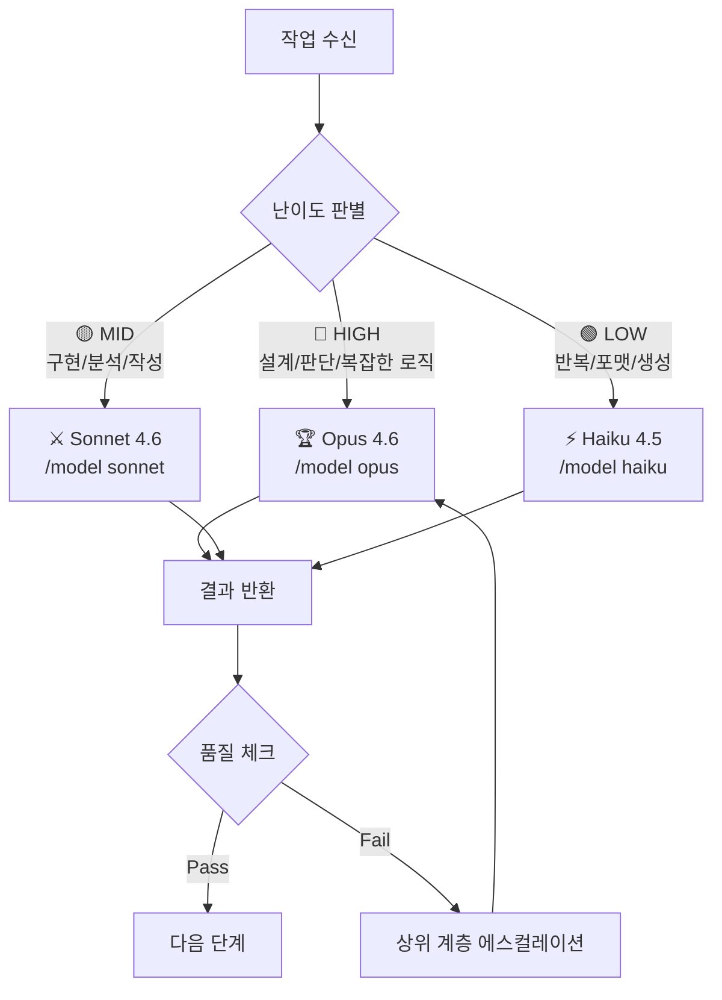

# 🏰 AI Agent Pipeline — 작업 명세서 (Work Specification)

> **목적**: Claude Code 터미널에서 이 파이프라인 프로젝트를 효율적으로 구현하기 위한 단계별 명세서
> **최종 수정**: 2026-02-20 v4 (Phase 5 — 실전 구현)
> **현재 상태**: Step 1~4 ✅ + Phase 5-A~5-E ✅ 완료 → **Phase 5 전체 완료**

---

## 🏗️ 파이프라인 아키텍처 (v3 — Redesigned)

```
┌──────────── 🌐 Gemini 영역 (사전 작업) ────────────┐
│                                                    │
│  Node 1 — Planner:  게임 기획, 핵심 메카닉 정의      │
│           Output: docs/GDD.md                      │
│                                                    │
│  Node 2 — Architect: 기술 설계, 스택 결정            │
│           Output: docs/SPEC.md                     │
│                                                    │
└───────────── [파일 저장: GDD.md + SPEC.md] ─────────┘
                            ↓
┌──────────── 🖥️ Claude Code 영역 (실행) ────────────┐
│                                                    │
│  Node 3' — Compiler: GDD+SPEC+Skill 흡수 →         │
│            실행 가능 명령어 세트 생성                 │
│                                                    │
│  Node 4 — Worker: 명령어 실행 → 코드 생성            │
│                                                    │
│  Node 5 — Auditor: 검증 → Pass/Fail               │
│           Fail → Compiler 또는 Worker로 루프백      │
│           (Gemini로는 돌아가지 않음)                  │
└────────────────────────────────────────────────────┘
```

### 루프백 정책
| Fail 유형 | 루프백 대상 | 자동/수동 |
|----------|-----------|--------|
| 코드 품질 이슈 | Node 4 (Worker) 재실행 | 자동 |
| 설계/변환 이슈 | Node 3' (Compiler) 재가공 | 자동 |
| 기획 이슈 | ⚠️ 사용자에게 알림 (Gemini 수동) | 수동 |

---

## 📋 프로젝트 현황

### 완료 ✅
| 항목 | 상태 |
|------|------|
| UI 보드 (레거시) | ✅ |
| Phase 2-A 스캐폴딩 (30개 파일) | ✅ |
| 팀 모드 서브 에이전트 (`src/agents/`) | ✅ |
| 파이프라인 재설계 (Prompter→Compiler) | ✅ 승인 |

### 완료 (Step 1~4) ✅
| 항목 | 상태 |
|------|------|
| 스캐폴딩 (30개 파일) | ✅ |
| Prompter→Compiler 리네임 | ✅ |
| PipelineEngine + EventBus + StateManager | ✅ |
| Compiler + Worker + Auditor 노드 로직 (mock) | ✅ |
| UI ↔ Pipeline 연동 + 루프백 시각화 | ✅ |

### 다음 작업: Phase 5 실전 구현 🔲
| 항목 | 우선순위 | Step |
|------|----------|------|
| **GDD/SPEC 입력 UI** (붙여넣기 + 파일 업로드) | 🔴 NOW | 5-A |
| **Compiler 실전화** (SPEC 파싱 → 실제 task 분해) | 🔴 HIGH | 5-B |
| **Worker 프롬프트 카드 UI** (step별 복사 + 확인) | 🔴 HIGH | 5-C |
| **Auditor 체크리스트 UI** (SPEC 완료 기준 검증) | 🟡 MID | 5-D |
| **통합 테스트** (실제 GDD/SPEC으로 전체 플로우) | 🟡 MID | 5-E |

---

## 🎯 Phase 2-A: 전체 스캐폴딩 (현재 단계)

> [!IMPORTANT]
> **원칙**: 모든 파일과 폴더를 먼저 생성하되, 실제 로직은 비워둔다.
> 각 파일에는 **인터페이스, 클래스 껍데기, export, TODO 주석**만 포함.

### 생성할 최종 폴더 구조

```
Game Planning-Agent/
├── index.html                  ← [수정] CSS/JS 외부 참조로 전환
│
├── styles/
│   ├── main.css                ← [NEW] 리셋, base, 배경, 헤더, 컨트롤, 반응형
│   ├── nodes.css               ← [NEW] 노드 룸, 아이콘, 상태 뱃지
│   ├── animations.css          ← [NEW] shimmer, pulse, blink, spark 등 모든 @keyframes
│   ├── detail-panel.css        ← [NEW] 디테일 오버레이 & 패널
│   ├── log-console.css         ← [NEW] 로그 콘솔 영역
│   └── connections.css         ← [NEW] SVG 커넥션, loop 카드, victory
│
├── src/
│   ├── app.js                  ← [NEW] 앱 엔트리 — 초기화, 이벤트 바인딩
│   ├── pipeline.js             ← [NEW] PipelineEngine 클래스 (빈 스텁)
│   ├── config.js               ← [NEW] NODES 데이터, NODE_ORDER, 상수
│   │
│   ├── agents/                 ← [NEW] 🔥 팀 모드 서브 에이전트 시스템
│   │   ├── team-manager.js     ← [NEW] TeamManager — 팀 구성 & 작업 분배
│   │   ├── agent-router.js     ← [NEW] AgentRouter — 난이도별 모델 자동 라우팅
│   │   └── agent-config.js     ← [NEW] 에이전트 계층/모델 설정 상수
│   │
│   ├── nodes/
│   │   ├── base-node.js        ← BaseNode 추상 클래스 (팀 모드 통합)
│   │   ├── planner.js          ← PlannerNode (Gemini — 참조용)
│   │   ├── architect.js        ← ArchitectNode (Gemini — 참조용)
│   │   ├── compiler.js         ← 🔥 CompilerNode (구 prompter → 리네임)
│   │   ├── worker.js           ← [NEW] WorkerNode extends BaseNode (빈 스텁)
│   │   └── auditor.js          ← [NEW] AuditorNode extends BaseNode (빈 스텁)
│   │
│   ├── ui/
│   │   ├── board-renderer.js   ← [NEW] 보드 렌더링 (기존 코드 이동)
│   │   ├── connections.js      ← [NEW] SVG 연결선 (기존 drawConnections 이동)
│   │   ├── detail-panel.js     ← [NEW] 디테일 패널 (기존 showDetail 이동)
│   │   ├── log-console.js      ← [NEW] 로그 콘솔 (기존 addLog 이동)
│   │   ├── victory.js          ← [NEW] 승리 오버레이 (기존 코드 이동)
│   │   └── particles.js        ← [NEW] 토치 파티클 (기존 createSparks 이동)
│   │
│   └── utils/
│       ├── state-manager.js    ← [NEW] 전역 상태 관리 (빈 스텁)
│       ├── storage.js          ← [NEW] localStorage 래퍼 (빈 스텁)
│       ├── event-bus.js        ← [NEW] 커스텀 이벤트 버스 (빈 스텁)
│       └── helpers.js          ← [NEW] sleep, 유틸 함수
│
├── templates/
│   ├── gdd-template.md         ← [NEW] GDD 생성용 마크다운 템플릿
│   └── spec-template.md        ← [NEW] SPEC 생성용 마크다운 템플릿
│
├── output/                     ← [NEW] Worker 출력 디렉토리 (빈 폴더)
│   └── .gitkeep
│
└── docs/
    ├── WORK_SPEC.md            ← 이 문서
    ├── GDD.md                  ← [NEW] 플레이스홀더 (Planner가 채울 예정)
    └── SPEC.md                 ← [NEW] 플레이스홀더 (Architect가 채울 예정)
```

---

## 🔥 팀 모드 (Sub-Agent Hierarchy)

> [!IMPORTANT]
> 각 파이프라인 노드는 **3계층 팀**을 거느립니다.
> 작업 난이도에 따라 적절한 에이전트에게 자동 위임합니다.

### 계층 구조

```
┌─────────────────────────────────────────────┐
│         🏆 팀 리더 (Team Leader)              │
│         Model: Opus 4.6                     │
│         역할: 전략 수립, 최종 판단, 품질 승인    │
│         호출 조건: 설계/판단/복잡한 의사결정      │
├─────────────────────────────────────────────┤
│         ⚔️ 팀원 (Team Member)                │
│         Model: Sonnet 4.6                   │
│         역할: 핵심 로직 구현, 코드 작성          │
│         호출 조건: 구현/분석/중간 난이도 작업     │
├─────────────────────────────────────────────┤
│         ⚡ 하청 서브 에이전트 (Sub-Agent)       │
│         Model: Haiku 4.5                    │
│         역할: 반복 작업, 포맷팅, 파일 생성       │
│         호출 조건: 기계적/패턴화된 작업           │
└─────────────────────────────────────────────┘
```

### 노드별 팀 운용 (Claude Code 영역만)

| 노드 | 리더 (Opus) | 팀원 (Sonnet) | 하청 (Haiku) |
|------|------------|--------------|-------------|
| **Compiler** | 컴파일 전략, SPEC 해석 판단 | GDD+SPEC → 명령어 변환 | 템플릿 조합, 포맷팅 |
| **Worker** | 복잡한 코드 리뷰 & 판단 | 핵심 코드 구현 | 보일러플레이트, 테스트 코드 |
| **Auditor** | Pass/Fail 최종 판정, 루프백 결정 | 기술 부채 분석, 점수 산출 | 파일 존재 확인, 린트 체크 |

> [!NOTE]
> Planner/Architect는 Gemini에서 수행하므로 팀 모드 적용 대상 아님.

### 작업 위임 흐름 (AgentRouter)



### `src/agents/agent-config.js` — 스텁 내용

```javascript
// 에이전트 계층 설정
export const AGENT_TIERS = {
  LEADER: {
    name: 'Team Leader',
    model: 'opus',           // /model opus
    icon: '🏆',
    costTier: 'HIGH',
    useFor: ['설계', '판단', '복잡한 의사결정', '최종 승인', '아키텍처']
  },
  MEMBER: {
    name: 'Team Member',
    model: 'sonnet',         // /model sonnet
    icon: '⚔️',
    costTier: 'MID',
    useFor: ['구현', '분석', '코드 작성', '문서 작성', '디버깅']
  },
  SUB_AGENT: {
    name: 'Sub Agent',
    model: 'haiku',          // /model haiku
    icon: '⚡',
    costTier: 'LOW',
    useFor: ['파일 생성', '포맷팅', '복사', '반복 작업', '린트', '주석']
  }
};

// 난이도 → 에이전트 매핑 규칙
export const ROUTING_RULES = {
  HIGH: 'LEADER',
  MID: 'MEMBER',
  LOW: 'SUB_AGENT'
};
```

### `src/agents/team-manager.js` — 스텁 내용

```javascript
import { AGENT_TIERS, ROUTING_RULES } from './agent-config.js';

export class TeamManager {
  constructor(nodeKey) {
    this.nodeKey = nodeKey;
    this.activeAgent = null;
  }

  // 작업 난이도에 따라 적절한 에이전트 선택
  selectAgent(taskDifficulty) {
    /* TODO: ROUTING_RULES 기반 에이전트 선택 */
    return null;
  }

  // 작업을 적절한 에이전트에게 위임
  async delegate(task) {
    /* TODO: 선택된 에이전트로 작업 위임 */
    return null;
  }

  // 결과 품질 체크 후 에스컬레이션 여부 판단
  async reviewAndEscalate(result) {
    /* TODO: 품질 미달 시 상위 계층으로 에스컬레이션 */
    return result;
  }

  // 현재 에이전트 상태 반환
  getStatus() {
    return { nodeKey: this.nodeKey, activeAgent: this.activeAgent };
  }
}
```

### `src/agents/agent-router.js` — 스텁 내용

```javascript
import { AGENT_TIERS } from './agent-config.js';

export class AgentRouter {
  // 작업 내용을 분석하여 난이도 판별
  static assessDifficulty(task) {
    /* TODO: 작업 키워드/유형 분석 → HIGH/MID/LOW 반환 */
    return 'MID';
  }

  // 난이도에 맞는 모델 명령어 반환
  static getModelCommand(difficulty) {
    /* TODO: '/model opus' | '/model sonnet' | '/model haiku' 반환 */
    return '/model sonnet';
  }

  // 에이전트 전환 로그 생성
  static logSwitch(fromTier, toTier, reason) {
    /* TODO: 모델 전환 이력 기록 */
  }
}
```

---

### 각 파일의 스텁 내용 명세 (기존 모듈)

#### `src/config.js` — 데이터만 export
```javascript
// 기존 index.html의 NODES 객체와 NODE_ORDER를 여기로 이동
export const NODES = { /* ... 기존 데이터 (prompter→compiler 키 변경) ... */ };
export const NODE_ORDER = ['planner', 'architect', 'compiler', 'worker', 'auditor'];
export const PIPELINE_STATES = { IDLE: 'idle', RUNNING: 'running', /* ... */ };
// Gemini 영역 노드 (Node 1-2, 참조용) vs Claude Code 영역 노드 (Node 3'-5, 실행)
export const CLAUDE_NODES = ['compiler', 'worker', 'auditor'];
```

#### `src/nodes/base-node.js` — 인터페이스 정의 (팀 모드 통합)
```javascript
import { TeamManager } from '../agents/team-manager.js';

export class BaseNode {
  constructor(key, config) {
    this.key = key;
    this.config = config;
    this.status = 'idle';
    this.team = new TeamManager(key);   // 각 노드가 팀을 거느림
  }
  async execute(input) { throw new Error('Not implemented'); }     // TODO: 각 노드에서 구현
  async validate(output) { throw new Error('Not implemented'); }   // TODO: 각 노드에서 구현
  getStatus() { return this.status; }
  getTeam() { return this.team; }                                 // 팀 상태 조회
}
```

#### `src/nodes/compiler.js` — 핵심 노드 (구 prompter.js 대체)
```javascript
import { BaseNode } from './base-node.js';
export class CompilerNode extends BaseNode {
  constructor(config) { super('compiler', config); }
  async execute(input) {
    // TODO: docs/GDD.md + docs/SPEC.md + skills/SKILL.md 읽기
    // TODO: SPEC에서 작업 단위(Task) 추출
    // TODO: 각 Task → Claude Code 실행 프롬프트로 변환
    // TODO: 팀 모드 적용 (Task 난이도 → 모델 배정)
    // TODO: output/execution-plan.json 생성
    return null;
  }
  async validate(output) {
    // TODO: execution-plan.json 유효성 검증 (필수 필드, 의존성 순서)
    return { pass: true, score: 0, issues: [] };
  }
}
```

#### `src/pipeline.js` — 클래스 껍데기
```javascript
import { EventBus } from './utils/event-bus.js';
export class PipelineEngine {
  constructor() { this.nodes = new Map(); this.state = 'idle'; this.eventBus = new EventBus(); }
  registerNode(node) { /* TODO */ }
  async run() { /* TODO: 순차 실행 */ }
  async executeNode(key) { /* TODO: 개별 노드 실행 */ }
  loopBack(targetKey, reason) { /* TODO: 피드백 루프 */ }
  getState() { return this.state; }
}
```

#### `src/utils/event-bus.js` — 이벤트 시스템 스텁
```javascript
export class EventBus {
  constructor() { this.listeners = new Map(); }
  on(event, callback) { /* TODO */ }
  emit(event, data) { /* TODO */ }
  off(event, callback) { /* TODO */ }
}
```

#### `templates/gdd-template.md`
```markdown
# Game Design Document
## 프로젝트명: {{PROJECT_NAME}}
## 장르: {{GENRE}}
## 핵심 메카닉: {{CORE_MECHANIC}}
## 아트 스타일: {{ART_STYLE}}
## 타겟 플랫폼: {{PLATFORM}}
<!-- Planner 노드가 이 템플릿을 기반으로 GDD를 자동 생성합니다 -->
```

#### `templates/spec-template.md`
```markdown
# Technical Specification
## 기술 스택: {{TECH_STACK}}
## 폴더 구조: {{FOLDER_STRUCTURE}}
## 의존성: {{DEPENDENCIES}}
## API 명세: {{API_SPEC}}
<!-- Architect 노드가 GDD를 기반으로 SPEC을 자동 생성합니다 -->
```

---

## 📝 Claude Code 복붙 프롬프트

> [!TIP]
> Step 1은 완료됨. 아래 Step 2부터 순서대로 진행하세요.

### ~~🔧 Step 1: 스캐폴딩 전체 생성~~ ✅ 완료

---

### 🧠 Step 2: 리네임 + 파이프라인 코어 구현 (⚡Haiku → ⚔️Sonnet)

**먼저 Haiku로 리네임:**
```
/model haiku
```
```
아래 리네임/수정 작업을 해주세요 (로직 구현 X, 이름만 변경):

1. src/nodes/prompter.js → src/nodes/compiler.js 리네임
   - 클래스명: PrompterNode → CompilerNode
   - key: 'prompter' → 'compiler'
   - 한글 주석 업데이트: "Compiler 노드 — GDD+SPEC+Skill을 흡수하여 Claude Code 실행 명령어 세트로 변환"

2. src/config.js 수정:
   - NODE_ORDER에서 'prompter' → 'compiler'
   - NODES 객체에서 prompter 키 → compiler 키
   - compiler 노드의 설명 업데이트:
     name: '마법사의 서재' → '컴파일러의 방'
     nameEn: 'Arcane Library' → 'Compiler Chamber'
     role: 'Prompter' → 'Compiler'
     description: 'GDD.md와 SPEC.md, Skill 파일을 흡수하여 Claude Code가 즉시 실행 가능한 명령어 세트로 컴파일합니다.'
     input: 'GDD.md + SPEC.md + SKILL.md'
     output: 'execution-plan.json (실행 명령어 세트)'
   - 추가: export const CLAUDE_NODES = ['compiler', 'worker', 'auditor'];

3. index.html의 data-node="prompter" → data-node="compiler" 수정
   - 노드 타이틀, 역할명도 함께 수정

4. src/app.js에서 prompter 관련 import/참조 → compiler로 수정

5. styles/nodes.css에서 .node-room[data-node="prompter"] → .node-room[data-node="compiler"] 수정
```

**그다음 Sonnet으로 코어 구현:**
```
/model sonnet
```
```
src/pipeline.js, src/utils/event-bus.js, src/utils/state-manager.js의 TODO를 구현해주세요.

■ PipelineEngine (src/pipeline.js):
- registerNode(node): 노드 등록
- async run(): CLAUDE_NODES만 순차 실행 (compiler → worker → auditor)
  · Planner/Architect는 Gemini에서 이미 완료 (실행하지 않음)
- async executeNode(key): 개별 노드 실행 + 이벤트 emit
- loopBack(targetKey, reason): 해당 노드부터 재실행
  · 루프백 범위: Claude Code 노드 내부만 (compiler/worker)
- 이벤트: 'node:start', 'node:complete', 'node:error', 'pipeline:complete', 'pipeline:loopback'
- state 전이: idle → running → (error → loopback → running) → complete

■ EventBus (src/utils/event-bus.js):
- on(event, callback): 리스너 등록
- emit(event, data): 이벤트 발생
- off(event, callback): 리스너 해제

■ StateManager (src/utils/state-manager.js):
- get(key): 상태 조회
- set(key, value): 상태 설정 + 구독자 알림
- subscribe(key, callback): 상태 변경 구독

주의: src/nodes/의 execute/validate는 아직 구현하지 마세요.
```

---

### ⚔️ Step 3: 노드 로직 구현 (🏆Opus → ⚔️Sonnet)

**Opus로 Compiler 설계:**
```
/model opus
```
```
src/nodes/compiler.js의 execute/validate를 설계하고 구현해주세요.

Compiler 노드의 역할:
1. docs/GDD.md + docs/SPEC.md 파일 읽기
2. SPEC에서 구현해야 할 작업 단위(Task)를 추출
3. 각 Task를 Claude Code에 바로 투입 가능한 프롬프트로 변환
4. 각 Task의 난이도 분석 → 팀 모드(Opus/Sonnet/Haiku) 배정
5. 실행 순서 결정 (의존성 그래프)
6. output/execution-plan.json 생성

execution-plan.json 포맷:
{
  "projectName": "...",
  "totalTasks": N,
  "tasks": [
    { "id": 1, "name": "...", "prompt": "...", "model": "haiku", "deps": [], "difficulty": "LOW" },
    { "id": 2, "name": "...", "prompt": "...", "model": "sonnet", "deps": [1], "difficulty": "MID" },
    ...
  ]
}
```

**Sonnet으로 Worker + Auditor 구현:**
```
/model sonnet
```
```
src/nodes/worker.js와 src/nodes/auditor.js의 execute/validate를 구현해주세요.

■ Worker:
- execute(): output/execution-plan.json 읽기 → 각 Task를 순서대로 처리
- 현재는 모킹: 각 Task의 prompt를 로그에 출력하고 '완료' 상태 기록
- 나중에 실제 Claude Code subprocess 호출로 교체 가능하도록 설계

■ Auditor:
- execute(): Worker가 생성한 파일들을 검증
  · 파일 존재 여부 확인
  · SPEC.md의 파일 목록과 실제 생성된 파일 비교
  · Debt Score 산출 (0~10, 임계치: 5.0)
- validate(): Pass/Fail 판정
  · Pass (score < 5.0): pipeline:complete 이벤트
  · Fail (score >= 5.0): 이유에 따라 compiler 또는 worker로 loopBack
```

---

### 🔗 Step 4: UI 연동 (⚔️Sonnet → ⚡Haiku)
```
/model sonnet
```
```
src/app.js에서 PipelineEngine과 UI를 연결해주세요:

1. Pipeline 이벤트 → UI 업데이트 바인딩
   - 'node:start' → setNodeStatus(key, 'active')
   - 'node:complete' → setNodeStatus(key, 'complete')
   - 'node:error' → setNodeStatus(key, 'error')
   - 'pipeline:loopback' → 루프백 시각화 트리거
   - 'pipeline:complete' → 승리 오버레이

2. Planner/Architect 노드는 항상 'complete' 상태로 표시
   (Gemini에서 이미 완료된 것으로 간주)

3. Run Pipeline 버튼 → Compiler → Worker → Auditor만 실행

4. 로그 콘솔에 실시간 이벤트 출력
```

**완료 후 Haiku로 정리:**
```
/model haiku
```
```
전체 코드 정리: 사용하지 않는 import 제거, 주석 통일, 코드 포맷팅
```

---

### 📄 Step 5-A: GDD/SPEC 입력 UI (⚡Haiku)

```
/model haiku
```
```
GDD.md와 SPEC.md를 브라우저에서 로드할 수 있는 UI를 구현해주세요.

■ 새 파일: src/ui/file-loader.js

기능:
1. 입력 방식 2가지:
   a. 텍스트 직접 붙여넣기 — <textarea>
   b. 파일 드래그앤드롭 / <input type="file" accept=".md">

2. GDD / SPEC 각각 독립적인 입력 영역
   - GDD 입력 → StateManager에 'source.gdd' 키로 저장
   - SPEC 입력 → StateManager에 'source.spec' 키로 저장
   - 둘 다 로드되면 Planner/Architect 노드를 자동으로 'complete' 상태로 전환

3. 입력 상태 표시:
   - 미입력: "📄 GDD 로드 필요" (회색)
   - 로드됨: "✅ GDD 로드 완료 (423줄)" (초록)

4. export 함수:
   - getGDD(): 현재 로드된 GDD 텍스트 반환
   - getSPEC(): 현재 로드된 SPEC 텍스트 반환
   - isReady(): GDD + SPEC 둘 다 로드됐는지 boolean

■ index.html 수정:
- 컨트롤 버튼 영역 아래에 "📄 소스 문서 로드" 접이식(collapsible) 패널 추가
- 기본 접힌 상태, 클릭하면 펼침
- 기존 CSS 변수 사용하여 스타일링

■ styles/ 수정:
- styles/main.css에 file-loader 관련 스타일 추가
- 드래그앤드롭 영역: 점선 테두리, 호버 시 글로우

■ src/app.js 수정:
- file-loader import 추가
- Run Pipeline 시 isReady() 체크 → 미로드면 알림

주의: StateManager를 PipelineEngine에서 가져와 사용 (engine.getState())
```

---

### 🏆 Step 5-B: Compiler 실전화 (Opus)

```
/model opus
```
```
src/nodes/compiler.js를 실전 로직으로 교체해주세요.
mock _compileSteps()를 제거하고, 실제 SPEC.md 파싱 기반으로 구현합니다.

■ _extractSources(input) 수정:
- StateManager에서 GDD/SPEC 텍스트를 직접 읽기
- this._stateManager = input?._stateManager ?? null;
- gdd = stateManager.get('source.gdd')
- spec = stateManager.get('source.spec')

■ _compileSteps(sources) → _parseAndCompile(gdd, spec) 교체:

파싱 규칙:
1. SPEC.md의 "## 6. 구현 순서" 섹션에서 번호 리스트(1. 2. 3.) 추출 → 각 줄이 하나의 task
2. SPEC.md의 "## 3. 핵심 모듈 설계" 섹션에서 ### 서브헤딩 추출 → 모듈별 구현 task 추가
3. SPEC.md의 "## 7. 완료 기준" 섹션에서 체크박스(- [ ]) 추출 → Auditor 검증 항목으로 저장
4. GDD.md의 "## 3. 핵심 메카닉" 섹션 내용을 각 task의 프롬프트에 컨텍스트로 포함

각 task의 프롬프트 생성 규칙:
- 프롬프트 앞에 GDD의 핵심 메카닉을 "[컨텍스트]"로 첨부
- SPEC의 기술 스택, 폴더 구조를 "[제약 조건]"으로 첨부
- task 본문을 "[작업 지시]"로 배치
- 모델 추천: 키워드 기반
  · '설계', '아키텍처', '결정' → HIGH → opus
  · '구현', '개발', '작성', '코드' → MID → sonnet
  · '생성', '복사', '포맷', '정리' → LOW → haiku

■ validate(output) 유지 (기존 검증 로직 그대로)

■ 섹션 파싱 유틸 함수 추가:
- _extractSection(markdown, headerPattern): ## 헤더로 섹션 추출
- _extractNumberedList(text): 번호 리스트 파싱
- _extractCheckboxes(text): 체크박스 항목 파싱
- _assessDifficulty(description): 키워드 기반 난이도 판별
- _buildPrompt(task, gddContext, specConstraints): 최종 프롬프트 조립
```

---

### ⚔️ Step 5-C: Worker 프롬프트 카드 UI (Sonnet)

```
/model sonnet
```
```
Worker 노드를 mock에서 실전으로 전환합니다.
프롬프트를 실행하는 대신, 사용자에게 카드로 표시하고 복사/확인 UI를 제공합니다.

■ 새 파일: src/ui/prompt-display.js

프롬프트 카드 UI:
1. Worker의 execution-plan steps를 카드 형태로 표시
2. 각 카드 구성:
   - step 번호 + phase 뱃지 (scaffolding/implementation/integration/polish)
   - 난이도 뱃지 (🏆HIGH / ⚔️MID / ⚡LOW)
   - 추천 모델 + /model 명령어 (예: "/model sonnet")
   - 프롬프트 본문 (코드 블록 스타일)
   - 📋 복사 버튼 → 클립보드에 프롬프트 복사
   - ✅ 완료 버튼 → 해당 step을 'complete'로 마킹
   - 상태 표시: ⏳대기 → 🔄진행 → ✅완료

3. step 진행 규칙:
   - step별 순차 진행 (이전 step 완료 후 다음 step 활성화)
   - dependsOn 미충족 시 건너뛸지/대기할지 표시
   - 모든 step 완료 시 Worker 노드 → 'complete' 상태 + Auditor로 진행

4. export 함수:
   - showPromptPanel(steps): 프롬프트 패널 열기
   - hidePromptPanel(): 닫기
   - onAllComplete(callback): 모든 step 완료 시 콜백

■ src/nodes/worker.js 수정:
- _executeStep() 내부 mock 제거
- 새 동작: 각 step을 prompt-display에 전달 → 사용자 확인 기반 진행
- execute() 수정: Promise 기반으로 사용자가 모든 step 완료할 때까지 대기

■ styles/detail-panel.css (또는 새 파일):
- 프롬프트 카드 스타일 — RPG 테마 유지
- 복사 버튼 클릭 시 "복사됨!" 피드백 애니메이션

■ index.html:
- 프롬프트 패널 오버레이 컨테이너 추가 (디테일 패널과 유사한 구조)
```

---

### ⚔️ Step 5-D: Auditor 체크리스트 UI (Sonnet)

```
/model sonnet
```
```
Auditor 노드를 실전 검증 로직으로 업데이트합니다.

■ src/nodes/auditor.js 수정:
- execute(input): Worker 결과 + SPEC의 "완료 기준" 기반으로 검증
  · StateManager에서 'source.spec' 읽기
  · Compiler가 추출한 acceptance criteria 사용
  · 각 기준을 체크리스트 UI로 표시
  · 사용자가 수동으로 확인 체크 → Pass 비율 산출
  · Debt Score = (미체크 항목 / 전체 항목) × 10

■ 새 파일: src/ui/checklist-display.js
- SPEC의 완료 기준을 체크리스트 카드로 표시
- 체크박스 UI + 메모 입력란
- "전체 확인 완료" 버튼
- export: showChecklist(criteria), getResults()

■ 루프백 판정 기존 로직 유지:
- score >= 5.0 → compiler 또는 worker로 루프백
- score < 5.0 → pass
```

---

### ⚔️ Step 5-E: 통합 (Sonnet → ⚡Haiku)

```
/model sonnet
```
```
Phase 5의 모든 모듈을 통합하고 전체 플로우를 연결합니다.

■ src/app.js 수정:
1. file-loader 연동:
   - Run Pipeline 클릭 시 isReady() 체크
   - 미로드 시 "GDD/SPEC을 먼저 로드하세요" 알림

2. Compiler → Worker 연결:
   - Compiler 결과(execution-plan)를 Worker에 전달
   - Worker가 prompt-display에 step 카드 표시
   - 사용자가 모든 step 완료 시 Auditor로 진행

3. Auditor 체크리스트 연결:
   - Auditor가 체크리스트 UI 표시
   - 사용자 확인 후 Pass/Fail 판정
   - Fail 시 루프백 시각화 + 해당 노드로 되돌림

4. 로그 콘솔에 실제 task 내용 표시:
   - Compiler: "6개 task 생성 (HIGH:1, MID:3, LOW:2)"
   - Worker: "Step 3/6: 게임 핵심 메카닉 구현 — 대기 중"
   - Auditor: "완료 기준 5/7 충족 — Debt Score: 2.9/10"
```

**완료 후 Haiku로 정리:**
```
/model haiku
```
```
전체 코드 정리: 사용하지 않는 import 제거, 주석 통일, 코드 포맷팅
```

---

## ✅ 체크포인트

### Step 1~4: 기반 구축 ✅ 완료
- [x] 스캐폴딩 (30개 파일)
- [x] Prompter→Compiler 리네임 (6개 파일)
- [x] PipelineEngine + EventBus + StateManager 구현
- [x] Compiler + Worker + Auditor 노드 (mock)
- [x] UI ↔ Pipeline 연동 + 루프백 시각화

### Phase 5: 실전 구현 (현재)
- [x] **5-A** GDD/SPEC 입력 UI (텍스트+파일 이중 입력)
- [x] **5-B** Compiler 실전화 (SPEC 파싱 → task 분해 → 프롬프트 생성)
- [x] **5-C** Worker 프롬프트 카드 UI (복사 버튼 + step별 확인)
- [x] **5-D** Auditor 체크리스트 UI (완료 기준 검증)
- [x] **5-E** 통합 + 실제 GDD/SPEC으로 테스트

---

## 🤖 모델 전환 전략 (팀 모드 기반)

### Phase 5 에이전트 운용

```
┌──────────────────────────────────────────────────────────┐
│  5-A 입력 UI                                              │
│    └─ ⚡ Haiku 4.5 — 기계적 UI 작업                       │
│                                                          │
│  5-B Compiler 실전화                                      │
│    └─ 🏆 Opus 4.6 — 핵심 파싱 로직 설계                   │
│                                                          │
│  5-C Worker 프롬프트 UI                                    │
│    └─ ⚔️ Sonnet 4.6 — UI + 비동기 대기 로직               │
│                                                          │
│  5-D Auditor 체크리스트                                    │
│    └─ ⚔️ Sonnet 4.6 — 검증 로직 + UI                     │
│                                                          │
│  5-E 통합                                                 │
│    ├─ ⚔️ Sonnet 4.6 — 모듈 연결                          │
│    └─ ⚡ Haiku 4.5 — 정리                                 │
└──────────────────────────────────────────────────────────┘
```

### Claude Code 모델 전환 명령어

| 계층 | 모델 | 명령어 | 언제 전환? |
|------|------|--------|----------|
| 🏆 리더 | Opus 4.6 | `/model opus` | 설계 판단이 필요할 때 |
| ⚔️ 팀원 | Sonnet 4.6 | `/model sonnet` | 구현/분석 작업 시 |
| ⚡ 하청 | Haiku 4.5 | `/model haiku` | 반복/기계적 작업 시 |

---

## 🔍 점검 요청 포맷

Antigravity에게 점검을 요청할 때:
```
점검 요청:
- 현재 Step: [5-A/5-B/5-C/5-D/5-E]
- 완료한 체크포인트: [항목]
- 사용한 모델: [opus/sonnet/haiku]
- 막힌 부분: [있으면 설명]
```
